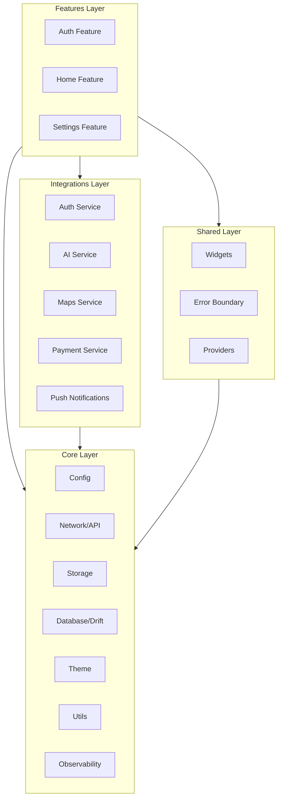

# Design Document: Flutter 2025 Final Polish

## Overview

Este documento descreve o design técnico para o polimento final do Flutter Base 2025, atualizando para Flutter 3.38 / Dart 3.10 e adicionando funcionalidades avançadas identificadas nas pesquisas mais recentes de dezembro 2025.

### Escopo

**Atualizações de Plataforma:**
- Flutter 3.38 / Dart 3.10 upgrade
- Dot shorthands adoption
- Widget Previewer support
- Predictive back gesture (Android 15+)
- NDK r28 / Java 17 configuration

**Novas Funcionalidades:**
- Patrol E2E testing framework
- DCM code quality integration
- Drift local database
- AI Toolkit preparation
- Enhanced accessibility testing
- Performance profiling automation

**Melhorias de Infraestrutura:**
- Error boundary widgets
- Code generation optimization
- Semantic versioning automation

## Architecture

### Updated Module Architecture



### New Project Structure Additions

```
lib/
├── core/
│   ├── database/                    # NEW
│   │   ├── app_database.dart
│   │   ├── app_database.g.dart
│   │   ├── tables/
│   │   │   └── base_table.dart
│   │   └── daos/
│   │       └── base_dao.dart
│   └── utils/
│       └── error_boundary.dart      # NEW
├── integrations/
│   └── ai/                          # NEW
│       └── ai_service.dart
└── shared/
    └── widgets/
        └── error_boundary_widget.dart  # NEW
```

## Components and Interfaces

### Drift Database Configuration

```dart
import 'package:drift/drift.dart';

part 'app_database.g.dart';

/// Base table mixin with common columns
mixin BaseTableMixin on Table {
  TextColumn get id => text()();
  DateTimeColumn get createdAt => dateTime().withDefault(currentDateAndTime)();
  DateTimeColumn get updatedAt => dateTime().nullable()();
  
  @override
  Set<Column> get primaryKey => {id};
}

/// App database with Drift
@DriftDatabase(tables: [/* tables */], daos: [/* daos */])
class AppDatabase extends _$AppDatabase {
  AppDatabase(super.e);
  
  @override
  int get schemaVersion => 1;
  
  @override
  MigrationStrategy get migration => MigrationStrategy(
    onCreate: (m) => m.createAll(),
    onUpgrade: (m, from, to) async {
      // Handle migrations
    },
  );
}
```

### Generic Drift Repository

```dart
/// Generic repository for Drift database operations
abstract class DriftRepository<T extends DataClass, ID> {
  final AppDatabase _db;
  
  DriftRepository(this._db);
  
  /// Table accessor - implemented by subclass
  TableInfo<Table, T> get table;
  
  /// ID column accessor
  GeneratedColumn<ID> get idColumn;
  
  /// Convert row to entity
  T fromRow(TypedResult row);
  
  /// Get by ID
  Future<Result<T>> getById(ID id) async {
    try {
      final query = _db.select(table)
        ..where((t) => idColumn.equals(id));
      final result = await query.getSingleOrNull();
      if (result == null) {
        return Failure(NotFoundFailure('Entity not found'));
      }
      return Success(result);
    } catch (e) {
      return Failure(CacheFailure(e.toString()));
    }
  }
  
  /// Watch all entities
  Stream<List<T>> watchAll() {
    return _db.select(table).watch();
  }
  
  /// Insert entity
  Future<Result<T>> insert(Insertable<T> entity) async {
    try {
      final id = await _db.into(table).insert(entity);
      return getById(id as ID);
    } catch (e) {
      return Failure(CacheFailure(e.toString()));
    }
  }
  
  /// Update entity
  Future<Result<T>> update(Insertable<T> entity) async {
    try {
      await _db.update(table).replace(entity);
      return Success(entity as T);
    } catch (e) {
      return Failure(CacheFailure(e.toString()));
    }
  }
  
  /// Delete by ID
  Future<Result<void>> delete(ID id) async {
    try {
      final query = _db.delete(table)
        ..where((t) => idColumn.equals(id));
      await query.go();
      return const Success(null);
    } catch (e) {
      return Failure(CacheFailure(e.toString()));
    }
  }
}
```

### Sync Repository with Conflict Resolution

```dart
enum ConflictResolution { serverWins, clientWins, merge }

/// Repository with offline sync support
abstract class SyncRepository<T extends DataClass, ID> 
    extends DriftRepository<T, ID> {
  
  final ApiClient _apiClient;
  final ConflictResolution _conflictResolution;
  
  SyncRepository(
    super.db,
    this._apiClient, {
    ConflictResolution conflictResolution = ConflictResolution.serverWins,
  }) : _conflictResolution = conflictResolution;
  
  /// Sync local changes to server
  Future<Result<void>> sync() async {
    final pendingChanges = await _getPendingChanges();
    
    for (final change in pendingChanges) {
      final result = await _syncChange(change);
      if (result.isFailure) {
        return result;
      }
    }
    
    return const Success(null);
  }
  
  /// Handle conflict based on resolution strategy
  Future<T> _resolveConflict(T local, T remote) async {
    return switch (_conflictResolution) {
      ConflictResolution.serverWins => remote,
      ConflictResolution.clientWins => local,
      ConflictResolution.merge => await mergeEntities(local, remote),
    };
  }
  
  /// Override to implement custom merge logic
  Future<T> mergeEntities(T local, T remote);
}
```

### AI Service Interface

```dart
/// AI service abstraction for future AI integrations
abstract interface class AIService {
  /// Generate text response
  Future<Result<String>> generateText(String prompt);
  
  /// Generate streaming response
  Stream<Result<String>> generateTextStream(String prompt);
  
  /// Generate structured response
  Future<Result<T>> generateStructured<T>(
    String prompt,
    T Function(Map<String, dynamic>) fromJson,
  );
}

/// Gemini AI implementation
class GeminiAIService implements AIService {
  final GenerativeModel _model;
  
  GeminiAIService(String apiKey)
      : _model = GenerativeModel(
          model: 'gemini-pro',
          apiKey: apiKey,
        );
  
  @override
  Future<Result<String>> generateText(String prompt) async {
    try {
      final response = await _model.generateContent([Content.text(prompt)]);
      return Success(response.text ?? '');
    } on GenerativeAIException catch (e) {
      return Failure(_mapAIError(e));
    }
  }
  
  @override
  Stream<Result<String>> generateTextStream(String prompt) async* {
    try {
      final response = _model.generateContentStream([Content.text(prompt)]);
      await for (final chunk in response) {
        yield Success(chunk.text ?? '');
      }
    } on GenerativeAIException catch (e) {
      yield Failure(_mapAIError(e));
    }
  }
  
  AppFailure _mapAIError(GenerativeAIException e) {
    return switch (e.runtimeType) {
      InvalidApiKey => AuthFailure('Invalid AI API key'),
      QuotaExceeded => RateLimitFailure('AI quota exceeded'),
      _ => ServerFailure('AI service error: ${e.message}'),
    };
  }
}
```

### Error Boundary Widget

```dart
/// Error boundary widget that catches and displays errors gracefully
class ErrorBoundary extends StatefulWidget {
  final Widget child;
  final Widget Function(Object error, StackTrace? stack)? errorBuilder;
  final void Function(Object error, StackTrace? stack)? onError;
  
  const ErrorBoundary({
    super.key,
    required this.child,
    this.errorBuilder,
    this.onError,
  });
  
  @override
  State<ErrorBoundary> createState() => _ErrorBoundaryState();
}

class _ErrorBoundaryState extends State<ErrorBoundary> {
  Object? _error;
  StackTrace? _stackTrace;
  
  @override
  void initState() {
    super.initState();
    // Set up error handler
    FlutterError.onError = _handleFlutterError;
  }
  
  void _handleFlutterError(FlutterErrorDetails details) {
    setState(() {
      _error = details.exception;
      _stackTrace = details.stack;
    });
    widget.onError?.call(details.exception, details.stack);
  }
  
  void _retry() {
    setState(() {
      _error = null;
      _stackTrace = null;
    });
  }
  
  @override
  Widget build(BuildContext context) {
    if (_error != null) {
      return widget.errorBuilder?.call(_error!, _stackTrace) ??
          _DefaultErrorWidget(
            error: _error!,
            onRetry: _retry,
          );
    }
    return widget.child;
  }
}

class _DefaultErrorWidget extends StatelessWidget {
  final Object error;
  final VoidCallback onRetry;
  
  const _DefaultErrorWidget({
    required this.error,
    required this.onRetry,
  });
  
  @override
  Widget build(BuildContext context) {
    final theme = Theme.of(context);
    return Center(
      child: Padding(
        padding: .all(24),
        child: Column(
          mainAxisSize: .min,
          children: [
            Icon(
              Icons.error_outline,
              size: 64,
              color: theme.colorScheme.error,
            ),
            const SizedBox(height: 16),
            Text(
              'Something went wrong',
              style: theme.textTheme.headlineSmall,
            ),
            const SizedBox(height: 8),
            Text(
              error.toString(),
              style: theme.textTheme.bodyMedium,
              textAlign: .center,
            ),
            const SizedBox(height: 24),
            FilledButton.icon(
              onPressed: onRetry,
              icon: const Icon(Icons.refresh),
              label: const Text('Try Again'),
            ),
          ],
        ),
      ),
    );
  }
}
```

### PopScope with Predictive Back

```dart
/// Enhanced PopScope for predictive back gesture
class PredictivePopScope extends StatelessWidget {
  final Widget child;
  final bool canPop;
  final Future<bool> Function()? onPopInvoked;
  
  const PredictivePopScope({
    super.key,
    required this.child,
    this.canPop = true,
    this.onPopInvoked,
  });
  
  @override
  Widget build(BuildContext context) {
    return PopScope(
      canPop: canPop,
      onPopInvokedWithResult: (didPop, result) async {
        if (didPop) return;
        
        final shouldPop = await onPopInvoked?.call() ?? true;
        if (shouldPop && context.mounted) {
          Navigator.of(context).pop();
        }
      },
      child: child,
    );
  }
}
```

### Performance Monitor Enhancement

```dart
/// Enhanced performance monitor with memory tracking
class PerformanceMonitor {
  static final _instance = PerformanceMonitor._();
  factory PerformanceMonitor() => _instance;
  PerformanceMonitor._();
  
  final _coldStartStopwatch = Stopwatch();
  final _memoryThreshold = 100 * 1024 * 1024; // 100MB
  
  /// Start cold start measurement
  void startColdStartMeasurement() {
    _coldStartStopwatch.start();
  }
  
  /// End cold start measurement
  Duration endColdStartMeasurement() {
    _coldStartStopwatch.stop();
    final duration = _coldStartStopwatch.elapsed;
    AppLogger.info('Cold start: ${duration.inMilliseconds}ms');
    return duration;
  }
  
  /// Check memory and cleanup if needed
  Future<void> checkMemoryAndCleanup({
    required VoidCallback onCleanup,
  }) async {
    final info = await SysInfo.getMemInfo();
    if (info.usedPhysMem > _memoryThreshold) {
      AppLogger.warning('Memory threshold exceeded, triggering cleanup');
      onCleanup();
    }
  }
  
  /// Measure API call duration
  Future<T> measureApiCall<T>(
    String endpoint,
    Future<T> Function() call,
  ) async {
    final stopwatch = Stopwatch()..start();
    try {
      return await call();
    } finally {
      stopwatch.stop();
      AppLogger.info('API $endpoint: ${stopwatch.elapsedMilliseconds}ms');
    }
  }
}
```

### Accessibility Testing Utilities

```dart
/// Accessibility test utilities
class AccessibilityTestUtils {
  /// Check if all buttons have semantic labels
  static bool allButtonsHaveLabels(WidgetTester tester) {
    final buttons = tester.widgetList<Widget>(
      find.byWidgetPredicate((w) => 
        w is ElevatedButton || 
        w is TextButton || 
        w is IconButton ||
        w is FilledButton ||
        w is OutlinedButton
      ),
    );
    
    for (final button in buttons) {
      final semantics = tester.getSemantics(find.byWidget(button));
      if (semantics.label.isEmpty && semantics.hint.isEmpty) {
        return false;
      }
    }
    return true;
  }
  
  /// Check if animations respect reduced motion
  static bool respectsReducedMotion(
    WidgetTester tester,
    Widget widget,
  ) {
    // Build with reduced motion enabled
    tester.pumpWidget(
      MediaQuery(
        data: const MediaQueryData(disableAnimations: true),
        child: widget,
      ),
    );
    
    // Verify no animations are running
    return !tester.hasRunningAnimations;
  }
}
```

## Data Models

### Dart 3.10 Dot Shorthands Examples

```dart
// Before (Dart 3.9)
Column(
  mainAxisAlignment: MainAxisAlignment.center,
  crossAxisAlignment: CrossAxisAlignment.start,
  children: [
    Padding(
      padding: EdgeInsets.all(16.0),
      child: Text('Hello'),
    ),
  ],
)

// After (Dart 3.10)
Column(
  mainAxisAlignment: .center,
  crossAxisAlignment: .start,
  children: [
    Padding(
      padding: .all(16.0),
      child: Text('Hello'),
    ),
  ],
)
```

### Widget Preview Annotations

```dart
import 'package:flutter/widgets.dart';

/// Preview annotation for Widget Previewer
@Preview(
  name: 'Default Button',
  width: 400,
  height: 100,
)
@Preview(
  name: 'Dark Theme Button',
  width: 400,
  height: 100,
  theme: ThemeMode.dark,
)
class AccessibleButton extends StatelessWidget {
  // ...
}

/// Multi-preview for variations
@MultiPreview([
  Preview(name: 'Small', width: 200, height: 50),
  Preview(name: 'Medium', width: 300, height: 75),
  Preview(name: 'Large', width: 400, height: 100),
])
class ResponsiveCard extends StatelessWidget {
  // ...
}
```

## Correctness Properties

*A property is a characteristic or behavior that should hold true across all valid executions of a system-essentially, a formal statement about what the system should do. Properties serve as the bridge between human-readable specifications and machine-verifiable correctness guarantees.*

### Property 1: PopScope Navigation Control
*For any* PopScope widget with `canPop: false`, attempting to pop SHALL be blocked and `onPopInvokedWithResult` SHALL be called.
**Validates: Requirements 4.3**

### Property 2: Drift Reactive Stream Emission
*For any* Drift repository watch operation, inserting, updating, or deleting an entity SHALL cause the stream to emit an updated list.
**Validates: Requirements 7.5, 8.3**

### Property 3: Repository CRUD Result Type
*For any* DriftRepository CRUD operation, the return type SHALL be `Result<T>` with `Success` on success and `Failure` on error.
**Validates: Requirements 8.2**

### Property 4: Sync Conflict Resolution
*For any* SyncRepository with conflict, the resolution SHALL follow the configured strategy (serverWins, clientWins, or merge).
**Validates: Requirements 8.4**

### Property 5: AI Error Mapping
*For any* AI service error, the error SHALL be mapped to the appropriate `AppFailure` subtype.
**Validates: Requirements 10.4**

### Property 6: Semantic Labels on Interactive Elements
*For any* interactive widget (Button, IconButton), the widget SHALL have a non-empty semantic label or hint.
**Validates: Requirements 11.3**

### Property 7: Reduced Motion Respect
*For any* widget with animations, when `MediaQuery.disableAnimations` is true, animations SHALL be disabled or instant.
**Validates: Requirements 11.5**

### Property 8: Memory Threshold Cache Cleanup
*For any* memory usage exceeding the configured threshold, the cleanup callback SHALL be invoked.
**Validates: Requirements 12.4**

### Property 9: Error Boundary Recovery
*For any* widget error caught by ErrorBoundary, the error UI SHALL be displayed and retry SHALL restore normal state.
**Validates: Requirements 14.1, 14.2, 14.4**

## Error Handling

### AI Error Mapping

```dart
AppFailure mapAIError(dynamic error) {
  return switch (error) {
    InvalidApiKey _ => AuthFailure('Invalid AI API key'),
    QuotaExceeded _ => RateLimitFailure('AI quota exceeded'),
    ContentBlocked _ => ValidationFailure('Content blocked by safety filters'),
    NetworkException _ => NetworkFailure('AI service unreachable'),
    _ => ServerFailure('AI service error: $error'),
  };
}
```

### Database Error Mapping

```dart
AppFailure mapDriftError(dynamic error) {
  return switch (error) {
    SqliteException e when e.extendedResultCode == 19 => 
      ConflictFailure('Unique constraint violation'),
    SqliteException e when e.extendedResultCode == 1555 => 
      ConflictFailure('Primary key constraint violation'),
    SqliteException _ => CacheFailure('Database error'),
    _ => UnexpectedFailure('Unexpected database error: $error'),
  };
}
```

## Testing Strategy

### Dual Testing Approach

- **Unit Tests**: Specific examples for services, repositories, and utilities
- **Property Tests**: Universal properties with Glados (100 iterations minimum)
- **E2E Tests**: Patrol for native UI automation

### Property Test Framework

```dart
// Example property test annotation format
// **Feature: flutter-2025-final-polish, Property 1: PopScope Navigation Control**
// **Validates: Requirements 4.3**
```

### Patrol E2E Test Example

```dart
import 'package:patrol/patrol.dart';

void main() {
  patrolTest('Login flow with native permission dialog', ($) async {
    await $.pumpWidgetAndSettle(const MyApp());
    
    // Tap login button
    await $(#loginButton).tap();
    
    // Handle native permission dialog
    await $.native.grantPermissionWhenInUse();
    
    // Verify navigation
    expect($(#homeScreen), findsOneWidget);
  });
}
```

### Accessibility Test Example

```dart
testWidgets('All buttons have semantic labels', (tester) async {
  await tester.pumpWidget(const MyApp());
  
  expect(
    AccessibilityTestUtils.allButtonsHaveLabels(tester),
    isTrue,
    reason: 'All interactive elements must have semantic labels',
  );
});
```

</content>
</invoke>