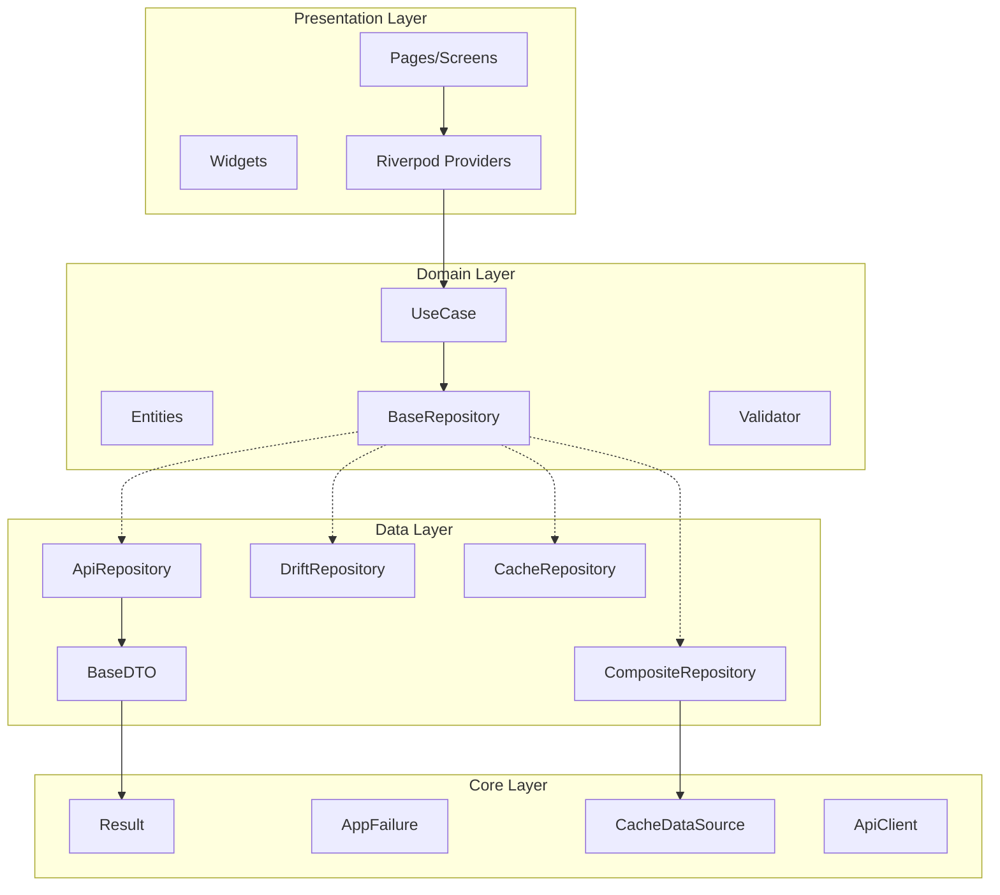

# Design Document: Flutter Base 2025 State of Art Review

## Overview

Este documento descreve o design para modernização do Flutter Base 2025, garantindo que esteja no "Estado da Arte" para desenvolvimento Flutter em 2025. O projeto será 100% genérico (`Generic<T>`), seguindo padrões SOLID, DRY, KISS, YAGNI, Clean Code, com testes property-based e pronto para produção.

### Objetivos
- Implementar padrões genéricos completos para Repository, UseCase, Validation
- Garantir que Result<T> siga as leis de monad
- Implementar serialização round-trip para DTOs
- Adicionar suporte completo a WCAG 2.2 para acessibilidade
- Configurar Riverpod 3.0 com code generation
- Implementar property-based testing com Glados

### Stack Tecnológico 2025
| Categoria | Biblioteca | Versão |
|-----------|-----------|--------|
| State Management | flutter_riverpod + riverpod_generator | 3.0.x |
| Navigation | go_router + go_router_builder | 17.x |
| Network | dio | 5.x |
| Database | drift + drift_dev | 2.29.x |
| Serialization | freezed + json_serializable | 3.x / 6.x |
| Functional | fpdart (referência) | 1.2.x |
| Testing | glados | 1.1.x |
| Linting | flutter_lints | 5.x |

## Architecture



### Clean Architecture Layers

| Layer | Responsabilidade | Dependências |
|-------|------------------|--------------|
| Presentation | UI, Widgets, Providers | Domain, Core |
| Domain | Entities, UseCases, Repository Interfaces | Nenhuma |
| Data | Repository Impl, DataSources, DTOs | Domain, Core |
| Core | Utils, Config, Network, Theme, Result | Nenhuma |

## Components and Interfaces

### 1. Generic Repository Pattern

```dart
/// Base repository interface with full CRUD operations
abstract interface class BaseRepository<T, ID> {
  Future<Result<T>> getById(ID id);
  Future<Result<PaginatedList<T>>> getAll({
    int page = 1,
    int pageSize = 20,
    Filter<T>? filter,
    Sort<T>? sort,
  });
  Future<Result<T>> create(T entity);
  Future<Result<T>> update(T entity);
  Future<Result<void>> delete(ID id);
  Future<Result<List<T>>> createMany(List<T> entities);
  Future<Result<void>> deleteMany(List<ID> ids);
  Stream<List<T>> watchAll();
  Future<Result<bool>> exists(ID id);
  Future<Result<int>> count({Filter<T>? filter});
  Future<Result<T?>> findFirst(Filter<T> filter);
}

/// API repository with DTO conversion
abstract class ApiRepository<T, D extends BaseDTO<T>, ID> 
    implements BaseRepository<T, ID> {
  final ApiClient apiClient;
  final D Function(Map<String, dynamic>) fromJson;
  final Map<String, dynamic> Function(T) toJson;
  
  // Automatic DTO-to-Entity conversion
  Future<Result<T>> _mapResponse(Future<Response> response);
}

/// Drift repository for local database
abstract class DriftRepository<T, ID> implements BaseRepository<T, ID> {
  final AppDatabase database;
  // Type-safe database operations via Drift
}

/// Cache repository with TTL and LRU
class CacheRepository<T> implements BaseRepository<T, String> {
  final CacheDataSource<T> cache;
  final Duration defaultTtl;
  final int maxSize;
}

/// Composite repository orchestrating multiple sources
class CompositeRepository<T, ID> implements BaseRepository<T, ID> {
  final BaseRepository<T, ID> remote;
  final BaseRepository<T, ID>? local;
  final CacheDataSource<T>? cache;
  
  // Strategy: Cache -> Local -> Remote
}
```

### 2. Generic UseCase Pattern

```dart
/// Standard use case with parameters
abstract interface class UseCase<Params, R> {
  Future<Result<R>> call(Params params);
}

/// Use case without parameters
abstract interface class NoParamsUseCase<R> {
  Future<Result<R>> call();
}

/// Streaming use case
abstract interface class StreamUseCase<Params, R> {
  Stream<Result<R>> call(Params params);
}

/// Composite use case for chaining
class CompositeUseCase<Params, R> implements UseCase<Params, R> {
  final List<UseCase<dynamic, dynamic>> useCases;
  
  @override
  Future<Result<R>> call(Params params) async {
    Result<dynamic> current = Success(params);
    for (final useCase in useCases) {
      current = await current.flatMapAsync(
        (value) => useCase.call(value),
      );
      if (current.isFailure) return Failure(current.failureOrNull!);
    }
    return current.map((value) => value as R);
  }
}
```

### 3. Result<T> Monad

```dart
/// Result type implementing monad laws
sealed class Result<T> {
  const Result();
  
  // Monad operations
  Result<R> map<R>(R Function(T) mapper);
  Result<R> flatMap<R>(Result<R> Function(T) mapper);
  
  // Combinators
  static Result<(A, B)> zip<A, B>(Result<A> a, Result<B> b);
  static Result<List<T>> sequence<T>(List<Result<T>> results);
  Result<T> recover(T Function(AppFailure) recovery);
  Result<T> tap(void Function(T) action);
  
  // Constructors
  static Result<T> tryCatch<T>(T Function() computation);
  static Future<Result<T>> fromFuture<T>(Future<T> Function() computation);
}

final class Success<T> extends Result<T> {
  final T value;
  const Success(this.value);
}

final class Failure<T> extends Result<T> {
  final AppFailure failure;
  const Failure(this.failure);
}
```

### 4. Generic Validation System

```dart
/// Validator function type
typedef Validator<T> = ValidationResult<T> Function(T value);

/// Validation result sealed class
sealed class ValidationResult<T> {
  bool get isValid;
  ValidationResult<R> map<R>(R Function(T) mapper);
  ValidationResult<R> flatMap<R>(ValidationResult<R> Function(T) mapper);
}

final class Valid<T> extends ValidationResult<T> {
  final T value;
  const Valid(this.value);
}

final class Invalid<T> extends ValidationResult<T> {
  final Map<String, List<String>> errors;
  const Invalid(this.errors);
  
  Invalid<T> merge(Invalid<T> other);
}

/// Composable validators
abstract final class TypedValidators {
  static Validator<String> required({String field, String? message});
  static Validator<String> email({String field, String? message});
  static Validator<String> minLength(int length, {String field});
  static Validator<String> maxLength(int length, {String field});
  static Validator<num> range(num min, num max, {String field});
  
  /// Composes validators, aggregating ALL errors
  static Validator<T> compose<T>(List<Validator<T>> validators);
  
  /// Composes validators, stopping at first failure
  static Validator<T> composeFailFast<T>(List<Validator<T>> validators);
}
```

### 5. Generic Cache with TTL

```dart
/// Cache entry with expiration
class CacheEntry<T> {
  final T value;
  final DateTime? expiresAt;
  bool get isExpired;
}

/// Generic cache interface
abstract interface class CacheDataSource<T> {
  Future<T?> get(String key);
  Future<void> set(String key, T value, {Duration? ttl});
  Future<void> invalidate(String key);
  Future<void> invalidateAll();
  Future<bool> has(String key);
}

/// LRU cache with TTL and max size
class LruCacheDataSource<T> implements CacheDataSource<T> {
  final int maxSize;
  final Duration? defaultTtl;
  
  // LRU eviction when maxSize reached
  // TTL expiration on get
}
```

### 6. Generic Pagination Notifier

```dart
/// Pagination state
@freezed
class PaginationState<T> with _$PaginationState<T> {
  const factory PaginationState({
    @Default([]) List<T> items,
    @Default(1) int currentPage,
    @Default(20) int pageSize,
    @Default(0) int totalItems,
    @Default(false) bool isLoading,
    @Default(false) bool isLoadingMore,
    AppFailure? error,
  }) = _PaginationState<T>;
  
  bool get hasMore => currentPage * pageSize < totalItems;
}

/// Generic pagination notifier
abstract class PaginationNotifier<T> extends Notifier<PaginationState<T>> {
  Future<void> loadInitial();
  Future<void> loadMore();
  Future<void> refresh();
  void reset();
  
  // Protected: fetch implementation
  Future<Result<PaginatedList<T>>> fetchPage(int page, int pageSize);
}
```

### 7. WebSocket Generic Client

```dart
/// Generic WebSocket client with typed messages
class WebSocketClient<T> {
  final String url;
  final T Function(Map<String, dynamic>) fromJson;
  final Map<String, dynamic> Function(T) toJson;
  
  Stream<T> get messages;
  Future<void> connect();
  Future<void> disconnect();
  void send(T message);
  
  // Automatic reconnection with exponential backoff
  final Duration initialDelay;
  final Duration maxDelay;
  final double multiplier;
}
```

### 8. Exception to Failure Mapping

```dart
/// Exception mapper
class ExceptionMapper {
  static AppFailure mapException(Object exception, StackTrace stackTrace) {
    return switch (exception) {
      NetworkException e => NetworkFailure(e.message, stackTrace: stackTrace),
      ServerException e => ServerFailure(e.message, statusCode: e.statusCode),
      ValidationException e => ValidationFailure(e.message, fieldErrors: e.errors),
      UnauthorizedException e => AuthFailure(e.message, stackTrace: stackTrace),
      NotFoundException e => NotFoundFailure(e.message, resourceType: e.type),
      _ => UnexpectedFailure(exception.toString(), stackTrace: stackTrace),
    };
  }
}
```

### 9. WCAG Accessibility Utilities

```dart
/// Color contrast utilities for WCAG compliance
extension WcagColorExtension on Color {
  /// Calculates relative luminance per WCAG 2.1
  double get relativeLuminance;
  
  /// Calculates contrast ratio (symmetric)
  double contrastRatio(Color other);
  
  /// Checks WCAG AA compliance (4.5:1 for normal text)
  bool meetsWcagAA(Color background);
  
  /// Checks WCAG AAA compliance (7:1)
  bool meetsWcagAAA(Color background);
}

/// Accessible widgets with minimum touch targets
class AccessibleButton extends StatelessWidget {
  // Enforces minimum 48x48 touch target
  static const double minTouchTarget = 48.0;
}
```

## Data Models

### Base DTO Interface

```dart
/// Base DTO with serialization contract
abstract class BaseDTO<T> {
  /// Converts DTO to domain entity
  T toEntity();
  
  /// Converts to JSON map
  Map<String, dynamic> toJson();
  
  /// Factory constructor from JSON (implemented by freezed)
  // factory BaseDTO.fromJson(Map<String, dynamic> json);
}

/// Example DTO with freezed
@freezed
class UserDTO with _$UserDTO implements BaseDTO<User> {
  const factory UserDTO({
    required String id,
    required String email,
    required String name,
    DateTime? createdAt,
  }) = _UserDTO;
  
  factory UserDTO.fromJson(Map<String, dynamic> json) => 
      _$UserDTOFromJson(json);
  
  @override
  User toEntity() => User(
    id: UserId(id),
    email: Email(email),
    name: name,
    createdAt: createdAt ?? DateTime.now(),
  );
}
```

### Paginated Response

```dart
@freezed
class PaginatedResponse<T> with _$PaginatedResponse<T> {
  const factory PaginatedResponse({
    required List<T> items,
    required int page,
    required int pageSize,
    required int totalItems,
    required int totalPages,
  }) = _PaginatedResponse<T>;
}

@freezed
class PaginatedList<T> with _$PaginatedList<T> {
  const factory PaginatedList({
    required List<T> items,
    required int currentPage,
    required int pageSize,
    required int totalItems,
  }) = _PaginatedList<T>;
  
  bool get hasMore => currentPage * pageSize < totalItems;
}
```

## Correctness Properties

*A property is a characteristic or behavior that should hold true across all valid executions of a system-essentially, a formal statement about what the system should do. Properties serve as the bridge between human-readable specifications and machine-verifiable correctness guarantees.*

Based on the prework analysis, the following correctness properties must be verified through property-based testing:

### Property 1: Result Monad Laws
*For any* value `a`, function `f: A -> Result<B>`, function `g: B -> Result<C>`, and Result `m`:
- Left Identity: `Success(a).flatMap(f) == f(a)`
- Right Identity: `m.flatMap(Success) == m`
- Associativity: `(m.flatMap(f)).flatMap(g) == m.flatMap((x) => f(x).flatMap(g))`
- Failure Propagation: `Failure(e).map(f) == Failure(e)` and `Failure(e).flatMap(f) == Failure(e)`

**Validates: Requirements 3.1, 3.2, 3.3, 3.4**

### Property 2: DTO Round-Trip Serialization
*For any* valid DTO instance `dto`, serializing to JSON and deserializing back should produce an equivalent DTO:
`DTO.fromJson(dto.toJson()) == dto`

This includes:
- Nullable fields handling
- Nested object preservation
- DateTime timezone and precision preservation

**Validates: Requirements 4.1, 4.2, 4.3, 4.4**

### Property 3: Validation Composition Aggregates All Errors
*For any* list of validators and input value, composing validators should aggregate ALL validation errors from ALL failing validators, not just the first one.

`compose([v1, v2, v3])(input).errors == v1(input).errors ∪ v2(input).errors ∪ v3(input).errors`

**Validates: Requirements 6.2, 6.3, 6.4**

### Property 4: Cache TTL Expiration
*For any* cache entry with TTL `t`, after duration `t` has elapsed, getting the entry should return null and the entry should be removed.

**Validates: Requirements 7.2, 7.3**

### Property 5: Cache LRU Eviction
*For any* LRU cache with max size `n`, when inserting the `(n+1)`th unique entry, the least recently used entry should be evicted.

**Validates: Requirements 7.4**

### Property 6: Exception to Failure Mapping Exhaustiveness
*For any* exception type in the defined set (NetworkException, ServerException, ValidationException, UnauthorizedException, NotFoundException), the mapper should produce the corresponding Failure type with all relevant data preserved.

**Validates: Requirements 8.1, 8.2, 8.3, 8.4, 8.5**

### Property 7: WCAG Contrast Ratio Symmetry
*For any* two colors `a` and `b`, the contrast ratio calculation should be symmetric:
`contrastRatio(a, b) == contrastRatio(b, a)`

**Validates: Requirements 9.2**

### Property 8: WCAG Contrast Thresholds
*For any* color pair with contrast ratio `r`:
- `meetsWcagAA(a, b) == true` iff `contrastRatio(a, b) >= 4.5`
- `meetsWcagAAA(a, b) == true` iff `contrastRatio(a, b) >= 7.0`

**Validates: Requirements 9.3, 9.4**

### Property 9: Pagination hasMore Calculation
*For any* pagination state with `currentPage`, `pageSize`, and `totalItems`:
`hasMore == (currentPage * pageSize < totalItems)`

**Validates: Requirements 5.2**

### Property 10: Pagination State Preservation on Error
*For any* pagination state with existing items, when loadMore fails, the existing items should be preserved unchanged.

**Validates: Requirements 5.4**

### Property 11: WebSocket Message Round-Trip
*For any* message of type T, serializing and deserializing should produce an equivalent message:
`fromJson(toJson(message)) == message`

**Validates: Requirements 11.2, 11.4**

### Property 12: Experiment Variant Persistence
*For any* experiment and user, once a variant is assigned, subsequent calls should return the same variant.

**Validates: Requirements 12.3**

## Error Handling

### Failure Hierarchy

```dart
sealed class AppFailure extends Equatable {
  final String message;
  final String? code;
  final StackTrace? stackTrace;
  final Map<String, dynamic>? context;
  
  String get userMessage; // User-friendly message
}

// Concrete failures
final class NetworkFailure extends AppFailure { ... }
final class CacheFailure extends AppFailure { ... }
final class ValidationFailure extends AppFailure {
  final Map<String, List<String>> fieldErrors;
}
final class AuthFailure extends AppFailure { ... }
final class ServerFailure extends AppFailure {
  final int? statusCode;
}
final class NotFoundFailure extends AppFailure {
  final String? resourceType;
  final String? resourceId;
}
final class ForbiddenFailure extends AppFailure { ... }
final class ConflictFailure extends AppFailure { ... }
final class RateLimitFailure extends AppFailure {
  final Duration? retryAfter;
}
final class UnexpectedFailure extends AppFailure { ... }
```

### Error Boundaries

```dart
/// Widget error boundary
class ErrorBoundary extends StatefulWidget {
  final Widget child;
  final Widget Function(FlutterErrorDetails) onError;
  
  @override
  void didChangeDependencies() {
    FlutterError.onError = (details) {
      // Log to crash reporter
      // Show error UI
    };
  }
}

/// Provider error handling
@riverpod
class AsyncDataNotifier extends _$AsyncDataNotifier {
  @override
  Future<Data> build() async {
    return ref.watch(repositoryProvider).getData().then(
      (result) => result.fold(
        (failure) => throw failure,
        (data) => data,
      ),
    );
  }
}
```

## Testing Strategy

### Dual Testing Approach

O projeto utiliza duas abordagens complementares de teste:

1. **Unit Tests**: Verificam exemplos específicos, edge cases e condições de erro
2. **Property-Based Tests**: Verificam propriedades universais que devem valer para todos os inputs

### Property-Based Testing com Glados

```dart
// Configuração: mínimo 100 iterações por property
Glados<int>(iterations: 100).test(
  'Property 1: Result left identity law',
  (value) {
    // **Feature: flutter-2025-state-of-art-review, Property 1: Result Monad Laws**
    // **Validates: Requirements 3.1**
    final f = (int x) => Success(x * 2);
    expect(Success(value).flatMap(f), equals(f(value)));
  },
);
```

### Custom Generators

```dart
// test/helpers/generators.dart
extension AnyFlutterBase on Any {
  Generator<AppFailure> get appFailure => any.choose([
    any.always(const NetworkFailure('Network error')),
    any.always(const ServerFailure('Server error', statusCode: 500)),
    any.always(const ValidationFailure('Validation error')),
    any.always(const AuthFailure('Auth error')),
    any.always(const NotFoundFailure('Not found')),
  ]);
  
  Generator<Result<int>> get resultInt => any.choose([
    any.int.map((i) => Success(i)),
    appFailure.map((f) => Failure<int>(f)),
  ]);
  
  Generator<Color> get color => combine3(
    any.intInRange(0, 255),
    any.intInRange(0, 255),
    any.intInRange(0, 255),
    (r, g, b) => Color.fromRGBO(r, g, b, 1.0),
  );
  
  Generator<UserDTO> get userDto => combine4(
    any.alphanumericString,
    any.email,
    any.alphanumericString,
    any.dateTime,
    (id, email, name, createdAt) => UserDTO(
      id: id,
      email: email,
      name: name,
      createdAt: createdAt,
    ),
  );
}
```

### Test Organization

```
test/
├── helpers/
│   ├── generators.dart      # Custom Arbitrary<T> generators
│   ├── mocks.dart           # Mock implementations
│   └── test_helpers.dart    # Test utilities
├── property/                # Property-based tests (100+ iterations)
│   ├── result_test.dart     # Property 1: Monad laws
│   ├── dto_test.dart        # Property 2: Round-trip
│   ├── validation_test.dart # Property 3: Composition
│   ├── cache_test.dart      # Properties 4, 5: TTL, LRU
│   ├── exception_mapping_test.dart # Property 6
│   ├── accessibility_test.dart # Properties 7, 8: WCAG
│   ├── pagination_test.dart # Properties 9, 10
│   ├── websocket_test.dart  # Property 11
│   └── experiment_test.dart # Property 12
├── unit/                    # Unit tests
│   ├── core/
│   └── features/
├── golden/                  # Golden/snapshot tests
└── integration/             # Integration tests
```

### Running Tests

```bash
# All tests
flutter test

# Property tests only
flutter test test/property/

# With coverage
flutter test --coverage

# Specific property test
flutter test test/property/result_test.dart
```
