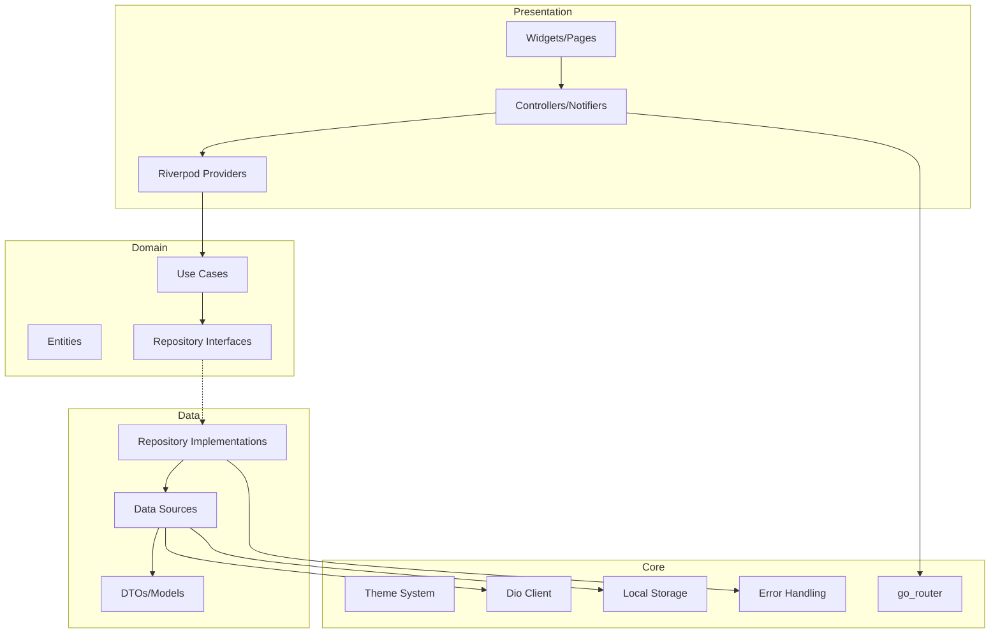
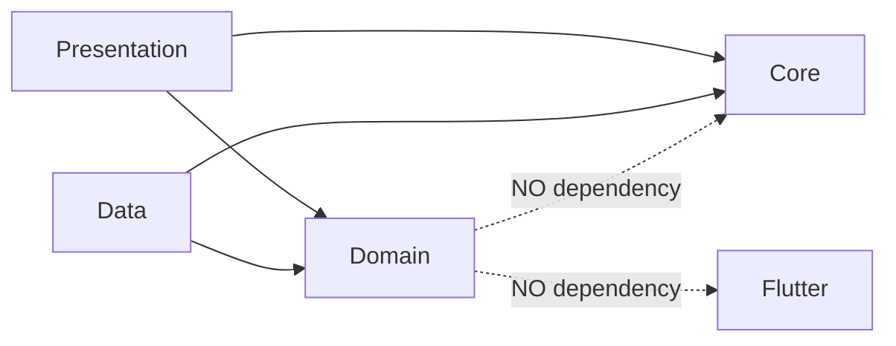
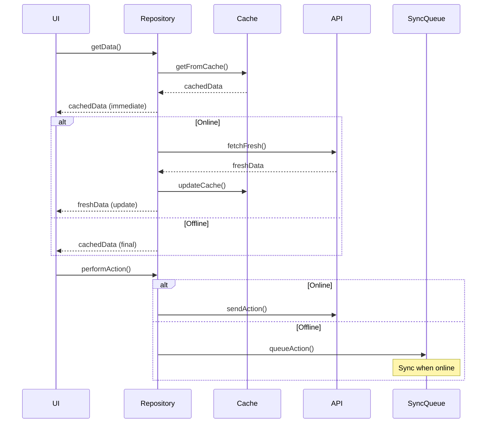
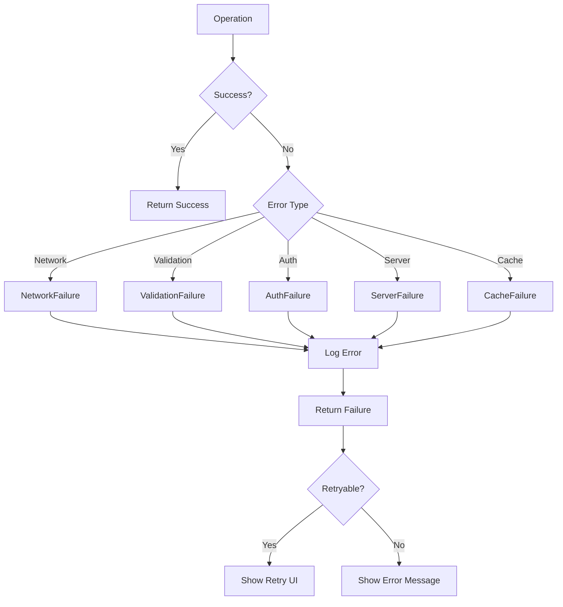

# Design Document: Flutter Base 2025

## Overview

Este documento descreve o design técnico para o template Flutter Base 2025 - um projeto base "estado da arte" para aplicações Flutter de produção. O template implementa Clean Architecture com abordagem feature-first, gerenciamento de estado com Riverpod, navegação declarativa com go_router, e práticas modernas de segurança, observabilidade e testes.

O objetivo é fornecer uma fundação escalável e testável que suporte mobile, web e desktop, com foco em:
- Separação clara de responsabilidades (Clean Architecture)
- Estado previsível e reativo (Riverpod)
- Navegação type-safe com deep links (go_router)
- Estratégia offline-first com sincronização
- Serialização robusta com garantias de round-trip
- Observabilidade completa (logs, crashes, analytics)

## Architecture

### High-Level Architecture



### Layer Dependencies



**Decisão de Design (ADR-001):** Domain layer sem dependências externas garante testabilidade pura e portabilidade. Use Cases e Entities são Dart puro.

## Components and Interfaces

### Project Structure

```
lib/
├── core/
│   ├── constants/
│   │   └── app_constants.dart
│   ├── errors/
│   │   ├── failures.dart
│   │   └── exceptions.dart
│   ├── network/
│   │   ├── dio_client.dart
│   │   └── interceptors/
│   ├── router/
│   │   ├── app_router.dart
│   │   └── route_guards.dart
│   ├── storage/
│   │   ├── secure_storage.dart
│   │   └── local_database.dart
│   ├── theme/
│   │   ├── app_theme.dart
│   │   └── theme_extensions.dart
│   └── utils/
│       ├── result.dart
│       └── validators.dart
├── features/
│   ├── auth/
│   │   ├── domain/
│   │   │   ├── entities/
│   │   │   ├── repositories/
│   │   │   └── usecases/
│   │   ├── data/
│   │   │   ├── datasources/
│   │   │   ├── models/
│   │   │   └── repositories/
│   │   └── presentation/
│   │       ├── providers/
│   │       ├── pages/
│   │       └── widgets/
│   ├── home/
│   │   └── [same structure]
│   └── settings/
│       └── [same structure]
├── shared/
│   ├── widgets/
│   ├── extensions/
│   └── mixins/
└── main.dart
```

### Core Interfaces

#### Result Type (Error Handling)

```dart
/// Result type para operações que podem falhar
/// Implementa Either pattern simplificado
sealed class Result<T> {
  const Result();
  
  R fold<R>(R Function(Failure) onFailure, R Function(T) onSuccess);
  bool get isSuccess;
  bool get isFailure;
}

final class Success<T> extends Result<T> {
  final T value;
  const Success(this.value);
}

final class Failure<T> extends Result<T> {
  final AppFailure failure;
  const Failure(this.failure);
}
```

**Decisão de Design (ADR-002):** Sealed class Result ao invés de Either do dartz para melhor suporte a pattern matching do Dart 3 e menos dependências.

#### Failure Hierarchy

```dart
sealed class AppFailure {
  final String message;
  final String? code;
  final StackTrace? stackTrace;
  
  const AppFailure(this.message, {this.code, this.stackTrace});
}

final class NetworkFailure extends AppFailure { ... }
final class CacheFailure extends AppFailure { ... }
final class ValidationFailure extends AppFailure {
  final Map<String, List<String>> fieldErrors;
}
final class AuthFailure extends AppFailure { ... }
final class ServerFailure extends AppFailure { ... }
```

#### Repository Interface Pattern

```dart
/// Interface no domain layer
abstract interface class AuthRepository {
  Future<Result<User>> login(String email, String password);
  Future<Result<User>> loginWithOAuth(OAuthProvider provider);
  Future<Result<void>> logout();
  Stream<AuthState> watchAuthState();
}

/// Implementação no data layer
final class AuthRepositoryImpl implements AuthRepository {
  final AuthRemoteDataSource _remoteDataSource;
  final AuthLocalDataSource _localDataSource;
  final NetworkInfo _networkInfo;
  
  // Implementação com offline-first strategy
}
```

### State Management (Riverpod)

#### Provider Structure

```dart
/// Providers como top-level final variables
final authStateProvider = StreamProvider<AuthState>((ref) {
  return ref.watch(authRepositoryProvider).watchAuthState();
});

final loginProvider = AsyncNotifierProvider<LoginNotifier, void>(() {
  return LoginNotifier();
});

/// AsyncNotifier para operações complexas
class LoginNotifier extends AsyncNotifier<void> {
  @override
  FutureOr<void> build() => null;
  
  Future<void> login(String email, String password) async {
    state = const AsyncLoading();
    final result = await ref.read(authRepositoryProvider).login(email, password);
    state = result.fold(
      (failure) => AsyncError(failure, StackTrace.current),
      (_) => const AsyncData(null),
    );
  }
}
```

**Decisão de Design (ADR-003):** AsyncNotifier ao invés de StateNotifier para melhor integração com async/await e lifecycle management automático.

### Navigation (go_router)

#### Router Configuration

```dart
final routerProvider = Provider<GoRouter>((ref) {
  final authState = ref.watch(authStateProvider);
  
  return GoRouter(
    initialLocation: '/',
    refreshListenable: GoRouterRefreshStream(authState),
    redirect: (context, state) {
      final isAuthenticated = authState.valueOrNull?.isAuthenticated ?? false;
      final isAuthRoute = state.matchedLocation.startsWith('/auth');
      
      if (!isAuthenticated && !isAuthRoute) return '/auth/login';
      if (isAuthenticated && isAuthRoute) return '/';
      return null;
    },
    routes: [
      ShellRoute(
        builder: (context, state, child) => MainShell(child: child),
        routes: [
          GoRoute(path: '/', builder: (_, __) => const HomePage()),
          GoRoute(path: '/settings', builder: (_, __) => const SettingsPage()),
        ],
      ),
      GoRoute(
        path: '/auth/login',
        builder: (_, __) => const LoginPage(),
      ),
    ],
  );
});
```

### Network Layer (Dio)

#### Dio Client Configuration

```dart
final dioProvider = Provider<Dio>((ref) {
  final dio = Dio(BaseOptions(
    baseUrl: AppConstants.apiBaseUrl,
    connectTimeout: const Duration(seconds: 30),
    receiveTimeout: const Duration(seconds: 30),
  ));
  
  dio.interceptors.addAll([
    AuthInterceptor(ref),
    LoggingInterceptor(),
    RetryInterceptor(dio: dio, retries: 3),
  ]);
  
  return dio;
});

/// Auth Interceptor com token refresh
class AuthInterceptor extends Interceptor {
  @override
  void onRequest(RequestOptions options, RequestInterceptorHandler handler) {
    final token = _getAccessToken();
    if (token != null) {
      options.headers['Authorization'] = 'Bearer $token';
    }
    handler.next(options);
  }
  
  @override
  void onError(DioException err, ErrorInterceptorHandler handler) async {
    if (err.response?.statusCode == 401) {
      final refreshed = await _refreshToken();
      if (refreshed) {
        return handler.resolve(await _retry(err.requestOptions));
      }
    }
    handler.next(err);
  }
}
```

### Offline-First Strategy



#### Sync Queue Implementation

```dart
abstract interface class SyncQueue {
  Future<void> enqueue(SyncAction action);
  Future<List<SyncAction>> getPendingActions();
  Future<void> processQueue();
  Stream<SyncStatus> watchSyncStatus();
}

@freezed
class SyncAction with _$SyncAction {
  const factory SyncAction({
    required String id,
    required String type,
    required Map<String, dynamic> payload,
    required DateTime createdAt,
    @Default(0) int retryCount,
  }) = _SyncAction;
}
```

## Data Models

### Entity vs DTO Pattern

```dart
/// Domain Entity (pure Dart, no annotations)
class User {
  final String id;
  final String email;
  final String name;
  final DateTime createdAt;
  
  const User({
    required this.id,
    required this.email,
    required this.name,
    required this.createdAt,
  });
}

/// Data DTO (with freezed for serialization)
@freezed
class UserDto with _$UserDto {
  const factory UserDto({
    required String id,
    required String email,
    required String name,
    @JsonKey(name: 'created_at') required DateTime createdAt,
  }) = _UserDto;
  
  factory UserDto.fromJson(Map<String, dynamic> json) => _$UserDtoFromJson(json);
  
  /// Mapper para Entity
  User toEntity() => User(
    id: id,
    email: email,
    name: name,
    createdAt: createdAt,
  );
  
  factory UserDto.fromEntity(User user) => UserDto(
    id: user.id,
    email: user.email,
    name: user.name,
    createdAt: user.createdAt,
  );
}
```

**Decisão de Design (ADR-004):** Separação Entity/DTO permite que domain layer permaneça puro enquanto data layer lida com serialização. Freezed gera código imutável e type-safe.

### Serialization Configuration

```dart
/// build.yaml configuration para json_serializable
targets:
  $default:
    builders:
      json_serializable:
        options:
          explicit_to_json: true
          include_if_null: false
          field_rename: snake
```

## Correctness Properties

*A property is a characteristic or behavior that should hold true across all valid executions of a system-essentially, a formal statement about what the system should do. Properties serve as the bridge between human-readable specifications and machine-verifiable correctness guarantees.*

### Property 1: Serialization Round-Trip Consistency

*For any* valid DTO instance, serializing to JSON and then deserializing back SHALL produce an object equal to the original.

```dart
// Pseudocode property
forAll((UserDto dto) {
  final json = dto.toJson();
  final restored = UserDto.fromJson(json);
  expect(restored, equals(dto));
});
```

**Validates: Requirements 5.1, 5.2, 5.3**

### Property 2: Nullable Field Handling

*For any* DTO with nullable fields, serialization SHALL correctly handle null values without data loss or corruption.

**Validates: Requirements 5.4**

### Property 3: Unknown Field Tolerance

*For any* valid JSON with additional unknown fields, deserialization SHALL succeed and ignore unknown fields.

**Validates: Requirements 5.5**

### Property 4: Domain Layer Purity

*For any* file in the domain layer, the file SHALL NOT import Flutter framework or external packages (except Dart core).

**Validates: Requirements 1.3**

### Property 5: Feature Structure Consistency

*For any* feature directory, it SHALL contain domain/, data/, and presentation/ subdirectories.

**Validates: Requirements 1.2**

### Property 6: Auth Guard Redirect

*For any* unauthenticated state and protected route, navigation SHALL redirect to login screen.

**Validates: Requirements 3.2**

### Property 7: Deep Link Resolution

*For any* valid deep link URL, the router SHALL resolve to the corresponding screen without errors.

**Validates: Requirements 3.3**

### Property 8: Route State Restoration

*For any* navigation state, serializing and deserializing SHALL restore the exact same route stack.

**Validates: Requirements 3.6**

### Property 9: Network Error Typing

*For any* network error, the repository SHALL return a typed Failure with appropriate error details.

**Validates: Requirements 4.3**

### Property 10: Token Refresh on Expiry

*For any* request with expired token, the interceptor SHALL attempt token refresh before failing.

**Validates: Requirements 7.4**

### Property 11: Logout Data Clearing

*For any* logout operation, ALL sensitive data SHALL be removed from secure storage.

**Validates: Requirements 7.5**

### Property 12: Auth State Route Sync

*For any* auth state change, navigation guards SHALL update routes accordingly.

**Validates: Requirements 7.6**

### Property 13: Offline Cache Fallback

*For any* data request when offline, the repository SHALL return cached data if available.

**Validates: Requirements 8.1**

### Property 14: Offline Action Queuing

*For any* write action performed offline, the action SHALL be queued for later sync.

**Validates: Requirements 8.2**

### Property 15: Queue Sync on Connectivity

*For any* queued action when connectivity is restored, the sync service SHALL process the queue.

**Validates: Requirements 8.3**

### Property 16: Conflict Resolution Consistency

*For any* sync conflict, the resolution strategy SHALL be applied consistently (last-write-wins or custom).

**Validates: Requirements 8.4**

### Property 17: Locale String Update

*For any* locale change, ALL translated strings SHALL update immediately without restart.

**Validates: Requirements 9.2**

### Property 18: Translation Fallback

*For any* missing translation key, the system SHALL fallback to default locale string.

**Validates: Requirements 9.3**

### Property 19: Locale-Aware Formatting

*For any* date or number formatting, the output SHALL respect current locale settings.

**Validates: Requirements 9.5**

### Property 20: Error Log Structure

*For any* logged error, the log entry SHALL include context, stack trace, and error code.

**Validates: Requirements 10.1, 13.3**

### Property 21: Result Type Consistency

*For any* operation failure, the return type SHALL be Result.Failure with typed AppFailure.

**Validates: Requirements 13.1**

### Property 22: Validation Failure Detail

*For any* validation failure, the ValidationFailure SHALL contain field-specific error messages.

**Validates: Requirements 13.5**

### Property 23: Theme Mode Switch

*For any* theme mode toggle (light/dark), the theme SHALL switch immediately without app restart.

**Validates: Requirements 6.2**

### Property 24: Responsive Layout Adaptation

*For any* screen size change, the layout SHALL adapt according to defined breakpoints.

**Validates: Requirements 6.3**

## Error Handling

### Error Flow



### Error Handling Strategy

| Error Type | Action | User Feedback |
|------------|--------|---------------|
| NetworkFailure | Log + Retry | "Sem conexão. Tentar novamente?" |
| ValidationFailure | Log | Field-specific errors |
| AuthFailure | Log + Redirect | "Sessão expirada. Faça login." |
| ServerFailure | Log + Report | "Erro no servidor. Tente mais tarde." |
| CacheFailure | Log + Clear | "Erro local. Dados serão recarregados." |

### Exception to Failure Mapping

```dart
Result<T> handleException<T>(Object error, StackTrace stack) {
  return switch (error) {
    DioException e => _handleDioException(e, stack),
    FormatException e => Failure(ValidationFailure(e.message, stackTrace: stack)),
    TypeError e => Failure(ValidationFailure('Tipo inválido', stackTrace: stack)),
    _ => Failure(ServerFailure('Erro inesperado', stackTrace: stack)),
  };
}

Result<T> _handleDioException<T>(DioException e, StackTrace stack) {
  return switch (e.type) {
    DioExceptionType.connectionTimeout ||
    DioExceptionType.receiveTimeout => Failure(NetworkFailure('Timeout', stackTrace: stack)),
    DioExceptionType.connectionError => Failure(NetworkFailure('Sem conexão', stackTrace: stack)),
    DioExceptionType.badResponse => _handleStatusCode(e.response?.statusCode, stack),
    _ => Failure(NetworkFailure(e.message ?? 'Erro de rede', stackTrace: stack)),
  };
}
```

## Testing Strategy

### Dual Testing Approach

O projeto utiliza duas abordagens complementares de testes:

1. **Unit Tests**: Verificam exemplos específicos, edge cases e condições de erro
2. **Property-Based Tests**: Verificam propriedades universais que devem valer para todas as entradas

### Testing Stack

| Tipo | Pacote | Propósito |
|------|--------|-----------|
| Unit/Widget | flutter_test | Testes básicos |
| Mocking | mocktail | Test doubles |
| Property-Based | glados | Testes de propriedade |
| Integration | integration_test | Fluxos completos |
| Coverage | coverage | Relatórios |

### Property-Based Testing com Glados

```dart
/// Exemplo de property test para serialização
@Tags(['property'])
void main() {
  Glados<UserDto>().test('round-trip serialization', (dto) {
    // **Feature: flutter-base-2025, Property 1: Serialization Round-Trip**
    final json = dto.toJson();
    final restored = UserDto.fromJson(json);
    expect(restored, equals(dto));
  });
  
  Glados<String>().test('unknown fields ignored', (extraField) {
    // **Feature: flutter-base-2025, Property 3: Unknown Field Tolerance**
    final json = {'id': '1', 'email': 'test@test.com', 'name': 'Test', extraField: 'ignored'};
    expect(() => UserDto.fromJson(json), returnsNormally);
  });
}
```

### Test Organization

```
test/
├── unit/
│   ├── core/
│   │   ├── result_test.dart
│   │   └── failures_test.dart
│   ├── features/
│   │   └── auth/
│   │       ├── domain/
│   │       │   └── usecases/
│   │       └── data/
│   │           ├── models/
│   │           └── repositories/
│   └── property/
│       ├── serialization_properties_test.dart
│       └── auth_properties_test.dart
├── widget/
│   └── features/
│       └── auth/
│           └── presentation/
└── integration/
    └── auth_flow_test.dart
```

### Generators para Property Tests

```dart
/// Custom generator para UserDto
extension UserDtoArbitrary on Any {
  Arbitrary<UserDto> get userDto => combine3(
    any.nonEmptyString,
    any.email,
    any.dateTime,
    (id, email, createdAt) => UserDto(
      id: id,
      email: email,
      name: 'Test User',
      createdAt: createdAt,
    ),
  );
}
```

### Minimum Test Iterations

Cada property test deve executar no mínimo **100 iterações** para garantir cobertura adequada de casos.

```dart
Glados<UserDto>(iterations: 100).test('property name', (dto) {
  // test implementation
});
```
