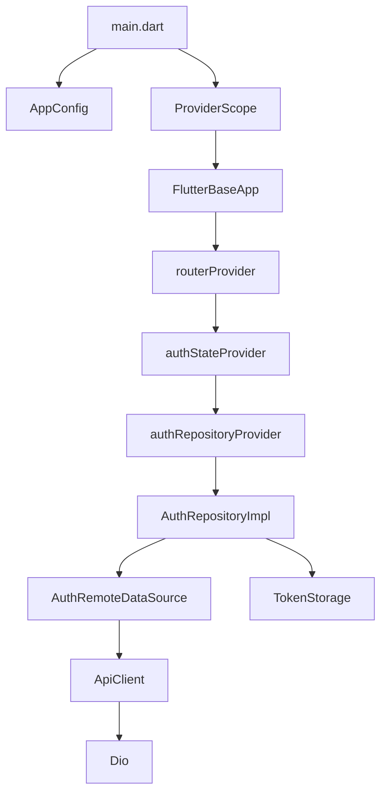

# Design Document - Flutter Code Review

## Overview

Este documento descreve o design para correção e limpeza do projeto Flutter Base 2025. O objetivo é transformar o projeto em um frontend puro, removendo código órfão, corrigindo integrações quebradas e preparando para produção.

## Architecture

O projeto segue Clean Architecture com as seguintes camadas:

```
┌─────────────────────────────────────────────────────────────┐
│                    Presentation Layer                        │
│  (Pages, Widgets, Providers - Riverpod)                     │
├─────────────────────────────────────────────────────────────┤
│                      Domain Layer                            │
│  (Entities, Repository Interfaces, Use Cases)               │
├─────────────────────────────────────────────────────────────┤
│                       Data Layer                             │
│  (DTOs, Repository Impl, Remote Datasources)                │
├─────────────────────────────────────────────────────────────┤
│                       Core Layer                             │
│  (Network, Config, Errors, Utils, Storage)                  │
└─────────────────────────────────────────────────────────────┘
```

### Decisões de Arquitetura

1. **Frontend Puro**: Toda lógica de negócio e persistência está no backend Python
2. **Token Storage**: Único armazenamento local permitido (flutter_secure_storage)
3. **API Client**: Único ponto de comunicação com backend via Dio
4. **State Management**: Riverpod 3.0 com code generation

## Components and Interfaces

### Arquivos a Remover

| Arquivo | Motivo |
|---------|--------|
| `lib/core/network/dio_client.dart` | Duplicado de api_client.dart |
| `lib/core/sync/` (pasta) | Vazia, lógica de sync é backend |
| `BaseLocalDataSource` em base_datasource.dart | Cache local é backend |

### Arquivos a Criar/Corrigir

| Arquivo | Ação |
|---------|------|
| `lib/core/storage/secure_storage.dart` | Criar alias para token_storage ou atualizar imports |
| `auth_provider.dart` | Remover imports quebrados, corrigir providers |
| `auth_repository_impl.dart` | Corrigir constructor para usar dependências corretas |
| `auth_remote_datasource.dart` | Atualizar import para api_client.dart |

### Fluxo de Dependências Corrigido



## Data Models

### Entidades (Domain Layer)

```dart
// User - Entidade pura sem dependências externas
class User {
  final String id;
  final String email;
  final String name;
  final String? avatarUrl;
  final DateTime createdAt;
  final DateTime? updatedAt;
}
```

### DTOs (Data Layer)

```dart
// UserDto - Com freezed e json_serializable
@freezed
class UserDto with _$UserDto {
  const factory UserDto({
    required String id,
    required String email,
    required String name,
    @JsonKey(name: 'avatar_url') String? avatarUrl,
    @JsonKey(name: 'created_at') required DateTime createdAt,
    @JsonKey(name: 'updated_at') DateTime? updatedAt,
  }) = _UserDto;
}
```

### AuthResponse (Data Layer)

```dart
class AuthResponse {
  final UserDto user;
  final String accessToken;
  final String refreshToken;
}
```

## Correctness Properties

*A property is a characteristic or behavior that should hold true across all valid executions of a system-essentially, a formal statement about what the system should do. Properties serve as the bridge between human-readable specifications and machine-verifiable correctness guarantees.*

### Property 1: Unauthenticated Redirect
*For any* navigation attempt to a protected route when user is not authenticated, the router SHALL redirect to the login page.
**Validates: Requirements 8.2**

### Property 2: Login Token Storage
*For any* successful login with valid credentials, the system SHALL store both access token and refresh token in secure storage.
**Validates: Requirements 8.3**

### Property 3: Logout Token Clearing
*For any* logout action, the system SHALL clear all tokens from secure storage and redirect to login.
**Validates: Requirements 8.4**

### Property 4: Single ApiClient Instance
*For any* network request in the application, it SHALL use the same ApiClient instance from api_client.dart.
**Validates: Requirements 1.1**

## Error Handling

### Estratégia de Erros

1. **Network Errors**: Capturados pelo ApiClient e convertidos para AppException
2. **Auth Errors**: 401 dispara refresh token automaticamente via AuthInterceptor
3. **Validation Errors**: Retornados como ValidationFailure com fieldErrors
4. **UI Errors**: Exibidos via SnackBar com mensagem amigável

### Hierarquia de Exceções

```dart
sealed class AppException {
  NetworkException
  ServerException
  ValidationException
  UnauthorizedException
  ForbiddenException
  NotFoundException
  RateLimitException
  CacheException
}
```

### Hierarquia de Failures

```dart
sealed class AppFailure {
  NetworkFailure
  CacheFailure
  ValidationFailure
  AuthFailure
  ServerFailure
  NotFoundFailure
  ForbiddenFailure
  ConflictFailure
  RateLimitFailure
  UnexpectedFailure
}
```

## Testing Strategy

### Dual Testing Approach

O projeto usa tanto testes unitários quanto property-based testing com Glados.

### Unit Tests

- Testes específicos para validação de DTOs
- Testes de integração para providers
- Testes de widgets para UI

### Property-Based Tests

- **Framework**: Glados (já configurado no pubspec.yaml)
- **Iterações**: Mínimo 100 por propriedade
- **Localização**: `test/property/`

### Testes a Atualizar

1. `test/helpers/mocks.dart` - Remover mocks de arquivos inexistentes
2. `test/helpers/generators.dart` - Remover generators de tipos inexistentes
3. Todos os testes que referenciam `SyncQueue`, `SecureStorage`, `AuthLocalDataSource`

### Formato de Anotação de Testes

```dart
// **Feature: flutter-code-review, Property 1: Unauthenticated Redirect**
// **Validates: Requirements 8.2**
```
