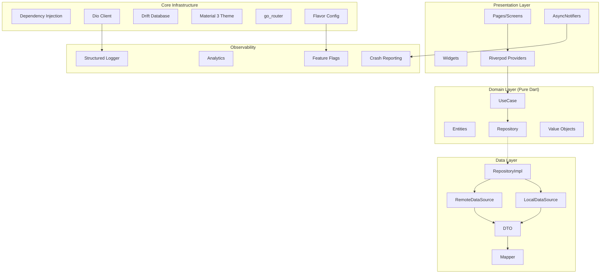
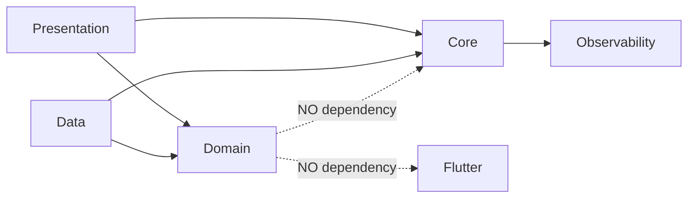
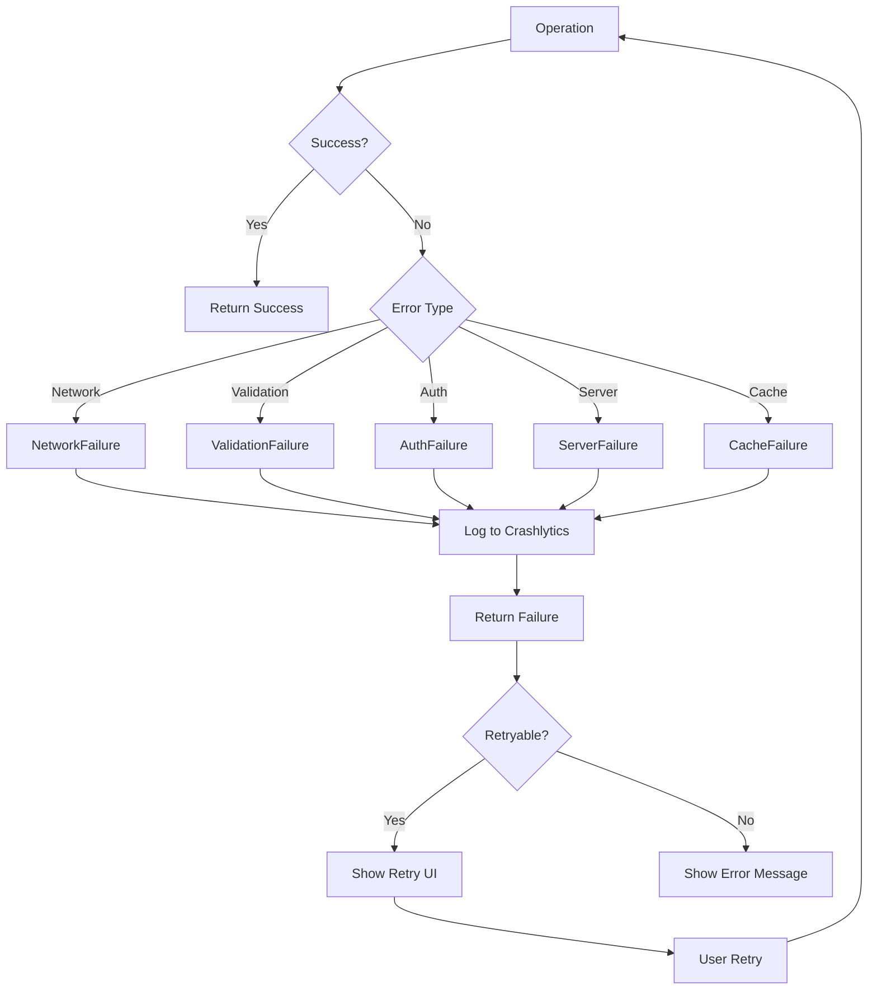

# Design Document: Flutter Modernization 2025

## Overview

Este documento descreve o design técnico para modernização do Flutter Base 2025 para o "estado da arte". O objetivo é transformar o template existente em uma base de projeto 100% pronta para produção, incorporando:

- **Flutter 3.27+ e Dart 3.6+** com novos recursos de linguagem
- **Riverpod 3.0** com AsyncNotifier, Mutations e Persistence
- **Generic Patterns** para Repository, DataSource, UseCase e DTOs
- **Docker e Kubernetes** para containerização e deploy
- **CI/CD otimizado** com GitHub Actions e quality gates
- **Observabilidade completa** com crash reporting, analytics e feature flags
- **Build Flavors** para development, staging e production

### Princípios de Design

1. **Type Safety First**: Uso extensivo de Generics<T> para eliminar erros em runtime
2. **Separation of Concerns**: Clean Architecture com camadas bem definidas
3. **Testability**: Código 100% testável com DI e interfaces
4. **Production Ready**: Configurações completas para deploy em produção
5. **Developer Experience**: Automação via Makefile e scripts

## Architecture

### High-Level Architecture



### Layer Dependencies



## Components and Interfaces

### Project Structure

```
flutter_base_2025/
├── lib/
│   ├── core/
│   │   ├── config/
│   │   │   ├── app_config.dart
│   │   │   ├── flavor_config.dart
│   │   │   └── environment.dart
│   │   ├── constants/
│   │   │   └── app_constants.dart
│   │   ├── di/
│   │   │   ├── injection.dart
│   │   │   └── injection.config.dart
│   │   ├── errors/
│   │   │   ├── failures.dart
│   │   │   └── exceptions.dart
│   │   ├── extensions/
│   │   │   ├── context_extensions.dart
│   │   │   └── string_extensions.dart
│   │   ├── generics/
│   │   │   ├── base_repository.dart
│   │   │   ├── base_remote_datasource.dart
│   │   │   ├── base_local_datasource.dart
│   │   │   ├── base_dto.dart
│   │   │   ├── base_usecase.dart
│   │   │   └── mapper.dart
│   │   ├── network/
│   │   │   ├── dio_client.dart
│   │   │   ├── api_response.dart
│   │   │   ├── paginated_response.dart
│   │   │   └── interceptors/
│   │   ├── observability/
│   │   │   ├── analytics_service.dart
│   │   │   ├── crash_reporter.dart
│   │   │   ├── feature_flags.dart
│   │   │   └── app_logger.dart
│   │   ├── router/
│   │   │   ├── app_router.dart
│   │   │   └── route_guards.dart
│   │   ├── storage/
│   │   │   ├── drift_database.dart
│   │   │   └── secure_storage.dart
│   │   ├── theme/
│   │   │   ├── app_theme.dart
│   │   │   ├── app_colors.dart
│   │   │   └── app_typography.dart
│   │   └── utils/
│   │       ├── result.dart
│   │       └── validators.dart
│   ├── features/
│   │   ├── auth/
│   │   │   ├── domain/
│   │   │   │   ├── entities/
│   │   │   │   ├── repositories/
│   │   │   │   └── usecases/
│   │   │   ├── data/
│   │   │   │   ├── datasources/
│   │   │   │   ├── models/
│   │   │   │   └── repositories/
│   │   │   └── presentation/
│   │   │       ├── providers/
│   │   │       ├── pages/
│   │   │       └── widgets/
│   │   ├── home/
│   │   └── settings/
│   ├── l10n/
│   │   ├── app_en.arb
│   │   └── app_pt.arb
│   ├── shared/
│   │   ├── providers/
│   │   └── widgets/
│   ├── main.dart
│   ├── main_development.dart
│   ├── main_staging.dart
│   └── main_production.dart
├── test/
│   ├── helpers/
│   │   ├── generators.dart
│   │   ├── mocks.dart
│   │   └── test_helpers.dart
│   ├── property/
│   ├── unit/
│   └── widget/
├── deployment/
│   ├── docker/
│   │   ├── Dockerfile
│   │   ├── Dockerfile.dev
│   │   ├── docker-compose.yml
│   │   ├── docker-compose.prod.yml
│   │   └── nginx.conf
│   ├── k8s/
│   │   ├── deployment.yaml
│   │   ├── service.yaml
│   │   ├── ingress.yaml
│   │   └── configmap.yaml
│   └── scripts/
│       ├── deploy.sh
│       └── health-check.sh
├── docs/
│   ├── adr/
│   ├── architecture.md
│   └── getting-started.md
├── .github/
│   └── workflows/
│       ├── ci.yml
│       ├── release.yml
│       └── docker.yml
├── Makefile
├── pubspec.yaml
└── analysis_options.yaml
```


### Generic Interfaces

#### BaseRepository<T, ID>

```dart
/// Interface genérica para repositórios com operações CRUD tipadas.
/// T = Entity type, ID = Identifier type (String, int, etc.)
abstract interface class BaseRepository<T, ID> {
  /// Busca entidade por ID
  Future<Result<T>> getById(ID id);
  
  /// Busca todas as entidades com paginação
  Future<Result<PaginatedList<T>>> getAll({
    int page = 1,
    int pageSize = 20,
    Filter<T>? filter,
    Sort<T>? sort,
  });
  
  /// Cria nova entidade
  Future<Result<T>> create(T entity);
  
  /// Atualiza entidade existente
  Future<Result<T>> update(T entity);
  
  /// Remove entidade por ID
  Future<Result<void>> delete(ID id);
  
  /// Operações em lote
  Future<Result<List<T>>> createMany(List<T> entities);
  Future<Result<void>> deleteMany(List<ID> ids);
  
  /// Stream para observar mudanças
  Stream<List<T>> watchAll();
}
```

#### BaseRemoteDataSource<T, ID>

```dart
/// Interface genérica para data sources remotos.
abstract interface class BaseRemoteDataSource<T, ID> {
  Future<T> get(ID id);
  Future<PaginatedResponse<T>> getAll({
    int page = 1,
    int pageSize = 20,
    Map<String, dynamic>? queryParams,
  });
  Future<T> create(T data);
  Future<T> update(ID id, T data);
  Future<void> delete(ID id);
}
```

#### BaseLocalDataSource<T, ID>

```dart
/// Interface genérica para data sources locais com cache.
abstract interface class BaseLocalDataSource<T, ID> {
  Future<T?> getCached(ID id);
  Future<List<T>> getAllCached();
  Future<void> cache(T data);
  Future<void> cacheAll(List<T> data);
  Future<void> clearCache();
  Future<bool> isCached(ID id);
  Future<DateTime?> getLastCacheTime();
}
```

#### Dto<E> Interface

```dart
/// Interface para DTOs com conversão para Entity.
abstract interface class Dto<E> {
  E toEntity();
  Map<String, dynamic> toJson();
}

/// Mixin para DTOs com fromEntity factory
mixin DtoFromEntity<E, D extends Dto<E>> {
  D fromEntity(E entity);
}
```

#### UseCase<Params, Result>

```dart
/// Interface genérica para casos de uso.
abstract interface class UseCase<Params, R> {
  Future<Result<R>> call(Params params);
}

/// Caso de uso sem parâmetros
abstract interface class NoParamsUseCase<R> {
  Future<Result<R>> call();
}

/// Caso de uso com Stream
abstract interface class StreamUseCase<Params, R> {
  Stream<Result<R>> call(Params params);
}

/// Singleton para casos sem parâmetros
final class NoParams {
  const NoParams._();
  static const instance = NoParams._();
}
```

### Result Type Aprimorado

```dart
/// Result type com operações funcionais completas.
sealed class Result<T> {
  const Result();
  
  // Pattern matching
  R fold<R>(R Function(AppFailure) onFailure, R Function(T) onSuccess);
  
  // Transformações
  Result<R> map<R>(R Function(T) mapper);
  Result<R> flatMap<R>(Result<R> Function(T) mapper);
  
  // Async transformações
  Future<Result<R>> mapAsync<R>(Future<R> Function(T) mapper);
  Future<Result<R>> flatMapAsync<R>(Future<Result<R>> Function(T) mapper);
  
  // Getters
  bool get isSuccess;
  bool get isFailure;
  T? get valueOrNull;
  AppFailure? get failureOrNull;
  T getOrElse(T Function() defaultValue);
  T getOrThrow();
  
  // Combinators
  Result<T> orElse(Result<T> Function() alternative);
  Result<T> recover(T Function(AppFailure) recovery);
}
```

### Paginated Response

```dart
/// Resposta paginada genérica.
@freezed
class PaginatedResponse<T> with _$PaginatedResponse<T> {
  const factory PaginatedResponse({
    required List<T> items,
    required int page,
    required int pageSize,
    required int totalItems,
    required int totalPages,
    required bool hasNextPage,
    required bool hasPreviousPage,
  }) = _PaginatedResponse<T>;
  
  factory PaginatedResponse.fromJson(
    Map<String, dynamic> json,
    T Function(Map<String, dynamic>) fromJsonT,
  ) => _$PaginatedResponseFromJson(json, fromJsonT);
}

/// Lista paginada para domain layer.
class PaginatedList<T> {
  final List<T> items;
  final int page;
  final int pageSize;
  final int totalItems;
  final bool hasMore;
  
  const PaginatedList({
    required this.items,
    required this.page,
    required this.pageSize,
    required this.totalItems,
    required this.hasMore,
  });
}
```

### Flavor Configuration

```dart
/// Configuração de flavor para diferentes ambientes.
enum Flavor { development, staging, production }

class FlavorConfig {
  final Flavor flavor;
  final String appName;
  final String baseUrl;
  final bool enableLogging;
  final bool enableCrashlytics;
  final bool showDebugBanner;
  
  static late FlavorConfig _instance;
  static FlavorConfig get instance => _instance;
  
  FlavorConfig._({
    required this.flavor,
    required this.appName,
    required this.baseUrl,
    required this.enableLogging,
    required this.enableCrashlytics,
    required this.showDebugBanner,
  });
  
  static void initialize(Flavor flavor) {
    _instance = switch (flavor) {
      Flavor.development => FlavorConfig._(
        flavor: flavor,
        appName: 'App Dev',
        baseUrl: 'https://dev-api.example.com',
        enableLogging: true,
        enableCrashlytics: false,
        showDebugBanner: true,
      ),
      Flavor.staging => FlavorConfig._(
        flavor: flavor,
        appName: 'App Staging',
        baseUrl: 'https://staging-api.example.com',
        enableLogging: true,
        enableCrashlytics: true,
        showDebugBanner: true,
      ),
      Flavor.production => FlavorConfig._(
        flavor: flavor,
        appName: 'App',
        baseUrl: 'https://api.example.com',
        enableLogging: false,
        enableCrashlytics: true,
        showDebugBanner: false,
      ),
    };
  }
  
  bool get isDevelopment => flavor == Flavor.development;
  bool get isStaging => flavor == Flavor.staging;
  bool get isProduction => flavor == Flavor.production;
}
```


## Data Models

### Entity vs DTO Pattern com Generics

```dart
/// Domain Entity (pure Dart, no annotations)
class User {
  final String id;
  final String email;
  final String name;
  final DateTime createdAt;
  
  const User({
    required this.id,
    required this.email,
    required this.name,
    required this.createdAt,
  });
}

/// Data DTO com freezed e implementação de Dto<E>
@freezed
class UserDto with _$UserDto implements Dto<User> {
  const UserDto._();
  
  const factory UserDto({
    required String id,
    required String email,
    required String name,
    @JsonKey(name: 'created_at') required DateTime createdAt,
  }) = _UserDto;
  
  factory UserDto.fromJson(Map<String, dynamic> json) => 
      _$UserDtoFromJson(json);
  
  @override
  User toEntity() => User(
    id: id,
    email: email,
    name: name,
    createdAt: createdAt,
  );
  
  static UserDto fromEntity(User user) => UserDto(
    id: user.id,
    email: user.email,
    name: user.name,
    createdAt: user.createdAt,
  );
}
```

### API Response Wrapper

```dart
/// Wrapper genérico para respostas de API.
@freezed
class ApiResponse<T> with _$ApiResponse<T> {
  const factory ApiResponse({
    required T data,
    required String message,
    required int statusCode,
    required DateTime timestamp,
    Map<String, dynamic>? meta,
  }) = _ApiResponse<T>;
  
  factory ApiResponse.fromJson(
    Map<String, dynamic> json,
    T Function(Object?) fromJsonT,
  ) => _$ApiResponseFromJson(json, fromJsonT);
}
```

### Drift Database Schema

```dart
/// Drift database com tabelas tipadas.
@DriftDatabase(tables: [Users, SyncActions, CacheMetadata])
class AppDatabase extends _$AppDatabase {
  AppDatabase() : super(_openConnection());
  
  @override
  int get schemaVersion => 1;
  
  @override
  MigrationStrategy get migration => MigrationStrategy(
    onCreate: (m) => m.createAll(),
    onUpgrade: (m, from, to) async {
      // Migration logic
    },
  );
}

/// Tabela de usuários
class Users extends Table {
  TextColumn get id => text()();
  TextColumn get email => text()();
  TextColumn get name => text()();
  DateTimeColumn get createdAt => dateTime()();
  DateTimeColumn get cachedAt => dateTime().withDefault(currentDateAndTime)();
  
  @override
  Set<Column> get primaryKey => {id};
}

/// Tabela de ações de sync offline
class SyncActions extends Table {
  TextColumn get id => text()();
  TextColumn get type => text()();
  TextColumn get payload => text()(); // JSON string
  DateTimeColumn get createdAt => dateTime()();
  IntColumn get retryCount => integer().withDefault(const Constant(0))();
  TextColumn get status => text().withDefault(const Constant('pending'))();
  
  @override
  Set<Column> get primaryKey => {id};
}
```

## Riverpod 3.0 Patterns

### AsyncNotifier com Progress

```dart
/// Provider com code generation
@riverpod
class AuthNotifier extends _$AuthNotifier {
  @override
  FutureOr<AuthState> build() async {
    // Inicialização com progress
    state = const AsyncLoading(progress: 0.0);
    
    final user = await ref.read(authRepositoryProvider).getCurrentUser();
    state = const AsyncLoading(progress: 0.5);
    
    return user.fold(
      (failure) => const AuthState.unauthenticated(),
      (user) => user != null 
          ? AuthState.authenticated(user) 
          : const AuthState.unauthenticated(),
    );
  }
  
  Future<void> login(String email, String password) async {
    state = const AsyncLoading();
    
    final result = await ref.read(authRepositoryProvider).login(email, password);
    
    state = result.fold(
      (failure) => AsyncError(failure, StackTrace.current),
      (user) => AsyncData(AuthState.authenticated(user)),
    );
  }
  
  Future<void> logout() async {
    await ref.read(authRepositoryProvider).logout();
    state = const AsyncData(AuthState.unauthenticated());
  }
}
```

### Mutation Pattern

```dart
/// Mutation para operações com feedback de UI
final addTodoMutation = Mutation<Todo>();

@riverpod
class TodosNotifier extends _$TodosNotifier {
  @override
  FutureOr<List<Todo>> build() async {
    final result = await ref.read(todoRepositoryProvider).getAll();
    return result.getOrElse(() => []);
  }
  
  Future<void> addTodo(String title) async {
    // Usa mutation para feedback
    await addTodoMutation.mutate(
      ref,
      () async {
        final todo = Todo(id: uuid.v4(), title: title, completed: false);
        final result = await ref.read(todoRepositoryProvider).create(todo);
        
        return result.fold(
          (failure) => throw failure,
          (created) {
            state = AsyncData([...state.value ?? [], created]);
            return created;
          },
        );
      },
    );
  }
}
```

### Persistence com @JsonPersist

```dart
/// Provider com persistência automática
@riverpod
@JsonPersist()
class SettingsNotifier extends _$SettingsNotifier {
  @override
  FutureOr<AppSettings> build() async {
    // persist() lê do storage e salva mudanças automaticamente
    persist(
      ref.watch(storageProvider.future),
      options: const StorageOptions(
        cacheTime: StorageCacheTime.unsafe_forever,
      ),
    );
    
    return const AppSettings(
      themeMode: ThemeMode.system,
      locale: 'en',
      notificationsEnabled: true,
    );
  }
  
  void updateThemeMode(ThemeMode mode) {
    state = AsyncData(state.value!.copyWith(themeMode: mode));
  }
}
```

## Docker Configuration

### Dockerfile (Multi-stage)

```dockerfile
# Stage 1: Build
FROM ghcr.io/cirruslabs/flutter:3.27.0 AS builder

WORKDIR /app

# Cache dependencies
COPY pubspec.* ./
RUN flutter pub get

# Copy source and build
COPY . .
RUN flutter build web --release --dart-define=FLUTTER_WEB_CANVASKIT_URL=/canvaskit/

# Stage 2: Runtime
FROM nginx:alpine

# Security headers
COPY deployment/docker/nginx.conf /etc/nginx/nginx.conf

# Copy built app
COPY --from=builder /app/build/web /usr/share/nginx/html

# Health check
HEALTHCHECK --interval=30s --timeout=3s --start-period=5s --retries=3 \
  CMD wget --no-verbose --tries=1 --spider http://localhost/health || exit 1

EXPOSE 80

CMD ["nginx", "-g", "daemon off;"]
```

### nginx.conf

```nginx
events {
    worker_connections 1024;
}

http {
    include /etc/nginx/mime.types;
    default_type application/octet-stream;
    
    # Gzip compression
    gzip on;
    gzip_types text/plain text/css application/json application/javascript text/xml application/xml;
    gzip_min_length 1000;
    
    server {
        listen 80;
        server_name localhost;
        root /usr/share/nginx/html;
        index index.html;
        
        # Security headers
        add_header X-Frame-Options "DENY" always;
        add_header X-Content-Type-Options "nosniff" always;
        add_header X-XSS-Protection "1; mode=block" always;
        add_header Referrer-Policy "strict-origin-when-cross-origin" always;
        add_header Content-Security-Policy "default-src 'self'; script-src 'self' 'unsafe-inline' 'unsafe-eval'; style-src 'self' 'unsafe-inline';" always;
        
        # Cache static assets
        location ~* \.(js|css|png|jpg|jpeg|gif|ico|svg|woff|woff2)$ {
            expires 1y;
            add_header Cache-Control "public, immutable";
        }
        
        # Health check endpoint
        location /health {
            access_log off;
            return 200 '{"status":"healthy","timestamp":"$time_iso8601"}';
            add_header Content-Type application/json;
        }
        
        # SPA fallback
        location / {
            try_files $uri $uri/ /index.html;
        }
    }
}
```

### docker-compose.yml

```yaml
version: '3.8'

services:
  app:
    build:
      context: ../..
      dockerfile: deployment/docker/Dockerfile
    ports:
      - "8080:80"
    environment:
      - FLUTTER_ENV=production
    healthcheck:
      test: ["CMD", "wget", "--spider", "-q", "http://localhost/health"]
      interval: 30s
      timeout: 10s
      retries: 3
    restart: unless-stopped
    
  # Optional: API mock for development
  api-mock:
    image: mockserver/mockserver:latest
    ports:
      - "1080:1080"
    profiles:
      - dev
```


## CI/CD Configuration

### GitHub Actions - ci.yml

```yaml
name: CI

on:
  push:
    branches: [main, develop]
  pull_request:
    branches: [main, develop]

env:
  FLUTTER_VERSION: '3.27.0'

jobs:
  analyze:
    name: Analyze & Format
    runs-on: ubuntu-latest
    steps:
      - uses: actions/checkout@v4
      
      - name: Setup Flutter
        uses: subosito/flutter-action@v2
        with:
          flutter-version: ${{ env.FLUTTER_VERSION }}
          cache: true
          cache-key: flutter-${{ env.FLUTTER_VERSION }}-${{ hashFiles('**/pubspec.lock') }}
      
      - name: Get dependencies
        run: flutter pub get
      
      - name: Check formatting
        run: dart format --set-exit-if-changed .
      
      - name: Analyze code
        run: flutter analyze --fatal-infos

  test:
    name: Test
    runs-on: ubuntu-latest
    needs: analyze
    strategy:
      matrix:
        test-type: [unit, property, widget]
    steps:
      - uses: actions/checkout@v4
      
      - name: Setup Flutter
        uses: subosito/flutter-action@v2
        with:
          flutter-version: ${{ env.FLUTTER_VERSION }}
          cache: true
      
      - name: Get dependencies
        run: flutter pub get
      
      - name: Run ${{ matrix.test-type }} tests
        run: flutter test test/${{ matrix.test-type }}/ --coverage
      
      - name: Upload coverage
        uses: codecov/codecov-action@v4
        with:
          files: coverage/lcov.info
          flags: ${{ matrix.test-type }}

  coverage-gate:
    name: Coverage Gate
    runs-on: ubuntu-latest
    needs: test
    steps:
      - uses: actions/checkout@v4
      
      - name: Setup Flutter
        uses: subosito/flutter-action@v2
        with:
          flutter-version: ${{ env.FLUTTER_VERSION }}
          cache: true
      
      - name: Run all tests with coverage
        run: flutter test --coverage
      
      - name: Check coverage threshold
        run: |
          COVERAGE=$(lcov --summary coverage/lcov.info | grep "lines" | awk '{print $2}' | sed 's/%//')
          if (( $(echo "$COVERAGE < 80" | bc -l) )); then
            echo "Coverage $COVERAGE% is below 80% threshold"
            exit 1
          fi
          echo "Coverage: $COVERAGE%"

  build:
    name: Build ${{ matrix.platform }}
    runs-on: ${{ matrix.os }}
    needs: coverage-gate
    if: github.event_name == 'push'
    strategy:
      matrix:
        include:
          - platform: android
            os: ubuntu-latest
          - platform: ios
            os: macos-latest
          - platform: web
            os: ubuntu-latest
    steps:
      - uses: actions/checkout@v4
      
      - name: Setup Java (Android)
        if: matrix.platform == 'android'
        uses: actions/setup-java@v4
        with:
          distribution: 'temurin'
          java-version: '17'
      
      - name: Setup Flutter
        uses: subosito/flutter-action@v2
        with:
          flutter-version: ${{ env.FLUTTER_VERSION }}
          cache: true
      
      - name: Build Android
        if: matrix.platform == 'android'
        run: flutter build apk --release --flavor production -t lib/main_production.dart
      
      - name: Build iOS
        if: matrix.platform == 'ios'
        run: flutter build ios --release --no-codesign --flavor production -t lib/main_production.dart
      
      - name: Build Web
        if: matrix.platform == 'web'
        run: flutter build web --release
      
      - name: Upload artifact
        uses: actions/upload-artifact@v4
        with:
          name: ${{ matrix.platform }}-build
          path: |
            build/app/outputs/flutter-apk/*.apk
            build/ios/iphoneos/*.app
            build/web/
          retention-days: 7
```

### Makefile

```makefile
.PHONY: help build test clean run analyze format

# Default target
help:
	@echo "Available targets:"
	@echo "  make build        - Run build_runner"
	@echo "  make test         - Run all tests"
	@echo "  make test-coverage - Run tests with coverage"
	@echo "  make analyze      - Run dart analyze"
	@echo "  make format       - Format code"
	@echo "  make clean        - Clean build artifacts"
	@echo "  make apk-dev      - Build development APK"
	@echo "  make apk-prod     - Build production APK"
	@echo "  make docker-build - Build Docker image"
	@echo "  make docker-run   - Run Docker container"

# Code generation
build:
	flutter pub run build_runner build --delete-conflicting-outputs

watch:
	flutter pub run build_runner watch --delete-conflicting-outputs

# Testing
test:
	flutter test

test-coverage:
	flutter test --coverage
	genhtml coverage/lcov.info -o coverage/html
	@echo "Coverage report: coverage/html/index.html"

test-property:
	flutter test test/property/

# Code quality
analyze:
	flutter analyze --fatal-infos

format:
	dart format .

check-format:
	dart format --set-exit-if-changed .

# Cleaning
clean:
	flutter clean
	rm -rf coverage/
	rm -rf build/

# Building
apk-dev:
	flutter build apk --flavor development -t lib/main_development.dart

apk-staging:
	flutter build apk --flavor staging -t lib/main_staging.dart

apk-prod:
	flutter build apk --release --flavor production -t lib/main_production.dart

ipa-dev:
	flutter build ipa --flavor development -t lib/main_development.dart

ipa-prod:
	flutter build ipa --release --flavor production -t lib/main_production.dart

web:
	flutter build web --release

# Docker
docker-build:
	docker build -f deployment/docker/Dockerfile -t flutter-app:latest .

docker-run:
	docker run -p 8080:80 flutter-app:latest

docker-compose-up:
	docker-compose -f deployment/docker/docker-compose.yml up -d

docker-compose-down:
	docker-compose -f deployment/docker/docker-compose.yml down

# Dependencies
upgrade:
	flutter pub upgrade --major-versions

outdated:
	flutter pub outdated
```

## Correctness Properties

*A property is a characteristic or behavior that should hold true across all valid executions of a system-essentially, a formal statement about what the system should do. Properties serve as the bridge between human-readable specifications and machine-verifiable correctness guarantees.*

### Property 1: Repository CRUD Type Safety

*For any* repository implementing BaseRepository<T, ID>, all CRUD operations SHALL return Result<T> or Result<void> with proper type parameters.

**Validates: Requirements 2.1, 2.2**

### Property 2: Pagination Response Completeness

*For any* getAll operation on a repository, the returned PaginatedList<T> SHALL contain valid page, pageSize, totalItems, and hasMore fields where hasMore equals (page * pageSize < totalItems).

**Validates: Requirements 2.3**

### Property 3: DTO Round-Trip Consistency

*For any* DTO implementing Dto<E>, serializing to JSON via toJson() and deserializing back via fromJson() SHALL produce an object equal to the original.

**Validates: Requirements 6.3, 6.4**

### Property 4: Entity-DTO Mapping Consistency

*For any* entity E and its corresponding DTO D, calling D.fromEntity(entity).toEntity() SHALL produce an entity equal to the original.

**Validates: Requirements 6.3**

### Property 5: UseCase Return Type Consistency

*For any* UseCase<Params, R> implementation, calling call(params) SHALL return Future<Result<R>> where R matches the declared type parameter.

**Validates: Requirements 14.1, 14.3**

### Property 6: AsyncNotifier State Preservation

*For any* AsyncNotifier, when state transitions from AsyncData to AsyncLoading, the previous data SHALL be accessible via state.valueOrNull.

**Validates: Requirements 3.12**

### Property 7: Provider Select Rebuild Optimization

*For any* provider watched with select(), widget rebuilds SHALL only occur when the selected value changes, not when other parts of the state change.

**Validates: Requirements 12.4**

### Property 8: Locale Change String Update

*For any* locale change, all widgets using AppLocalizations SHALL display strings in the new locale without requiring app restart.

**Validates: Requirements 16.2**

### Property 9: Feature Flag Consistency

*For any* feature flag, FeatureFlags.isEnabled(flagName) SHALL return the same boolean value for the same flag name within a single app session (until remote config refresh).

**Validates: Requirements 21.4**

### Property 10: Deep Link Navigation Resolution

*For any* valid deep link URI matching a defined route pattern, the router SHALL navigate to the corresponding screen with correct parameters extracted from the URI.

**Validates: Requirements 23.1**

### Property 11: Analytics Screen View Logging

*For any* screen navigation via go_router, a screen_view event SHALL be logged with the correct screen name and class.

**Validates: Requirements 22.1**

### Property 12: Error State Retry Action

*For any* AsyncValue.error state displayed in UI, a retry action SHALL be available that re-executes the failed operation.

**Validates: Requirements 17.2**

### Property 13: Touch Target Minimum Size

*For any* interactive widget (buttons, links, checkboxes), the touch target size SHALL be at least 48x48 logical pixels.

**Validates: Requirements 15.3**

### Property 14: Result Type Fold Exhaustiveness

*For any* Result<T>, calling fold() with onFailure and onSuccess handlers SHALL execute exactly one handler based on the result state.

**Validates: Requirements 2.2, 14.3**

### Property 15: Flavor Config Isolation

*For any* flavor (development, staging, production), FlavorConfig.instance SHALL return configuration values specific to that flavor without cross-contamination.

**Validates: Requirements 18.1, 18.3**


## Error Handling

### Error Flow



### Failure Hierarchy

```dart
/// Base failure class
sealed class AppFailure {
  final String message;
  final String? code;
  final StackTrace? stackTrace;
  final Map<String, dynamic>? context;
  
  const AppFailure(
    this.message, {
    this.code,
    this.stackTrace,
    this.context,
  });
  
  bool get isRetryable;
}

final class NetworkFailure extends AppFailure {
  final int? statusCode;
  
  const NetworkFailure(super.message, {
    this.statusCode,
    super.code,
    super.stackTrace,
  });
  
  @override
  bool get isRetryable => true;
}

final class ValidationFailure extends AppFailure {
  final Map<String, List<String>> fieldErrors;
  
  const ValidationFailure(
    super.message, {
    required this.fieldErrors,
    super.code,
  });
  
  @override
  bool get isRetryable => false;
}

final class AuthFailure extends AppFailure {
  const AuthFailure(super.message, {super.code, super.stackTrace});
  
  @override
  bool get isRetryable => false;
}

final class ServerFailure extends AppFailure {
  const ServerFailure(super.message, {super.code, super.stackTrace});
  
  @override
  bool get isRetryable => true;
}

final class CacheFailure extends AppFailure {
  const CacheFailure(super.message, {super.code, super.stackTrace});
  
  @override
  bool get isRetryable => true;
}
```

### Global Error Handler

```dart
/// Configuração de error handling global
void setupErrorHandling() {
  // Flutter errors
  FlutterError.onError = (details) {
    FlutterError.presentError(details);
    CrashReporter.instance.recordFlutterError(details);
  };
  
  // Platform errors
  PlatformDispatcher.instance.onError = (error, stack) {
    CrashReporter.instance.recordError(error, stack);
    return true;
  };
}

/// Executa app com zone para capturar erros async
void main() {
  runZonedGuarded(
    () {
      WidgetsFlutterBinding.ensureInitialized();
      setupErrorHandling();
      runApp(const ProviderScope(child: App()));
    },
    (error, stack) {
      CrashReporter.instance.recordError(error, stack);
    },
  );
}
```

## Testing Strategy

### Dual Testing Approach

O projeto utiliza duas abordagens complementares:

1. **Unit Tests**: Verificam exemplos específicos, edge cases e condições de erro
2. **Property-Based Tests**: Verificam propriedades universais que devem valer para todas as entradas

### Testing Stack

| Tipo | Pacote | Propósito |
|------|--------|-----------|
| Unit/Widget | flutter_test | Testes básicos |
| Mocking | mocktail | Test doubles |
| Property-Based | glados | Testes de propriedade |
| Integration | integration_test | Fluxos completos |
| Coverage | coverage | Relatórios |
| Golden | golden_toolkit | Screenshot tests |

### Property-Based Testing com Glados

```dart
/// Generators customizados para domain entities
extension UserArbitrary on Any {
  Arbitrary<User> get user => combine4(
    any.nonEmptyString,
    any.email,
    any.nonEmptyString,
    any.dateTime,
    (id, email, name, createdAt) => User(
      id: id,
      email: email,
      name: name,
      createdAt: createdAt,
    ),
  );
}

extension UserDtoArbitrary on Any {
  Arbitrary<UserDto> get userDto => any.user.map(UserDto.fromEntity);
}

/// Property test para round-trip
@Tags(['property'])
void main() {
  group('DTO Round-Trip Properties', () {
    Glados<UserDto>(iterations: 100).test(
      'UserDto round-trip serialization preserves equality',
      (dto) {
        // **Feature: flutter-modernization-2025, Property 3: DTO Round-Trip**
        final json = dto.toJson();
        final restored = UserDto.fromJson(json);
        expect(restored, equals(dto));
      },
    );
    
    Glados<User>(iterations: 100).test(
      'User entity-DTO mapping round-trip preserves equality',
      (user) {
        // **Feature: flutter-modernization-2025, Property 4: Entity-DTO Mapping**
        final dto = UserDto.fromEntity(user);
        final restored = dto.toEntity();
        expect(restored, equals(user));
      },
    );
  });
  
  group('Result Type Properties', () {
    Glados<int>(iterations: 100).test(
      'Result.fold executes exactly one handler',
      (value) {
        // **Feature: flutter-modernization-2025, Property 14: Result Fold**
        var successCalled = false;
        var failureCalled = false;
        
        final result = Success(value);
        result.fold(
          (_) => failureCalled = true,
          (_) => successCalled = true,
        );
        
        expect(successCalled, isTrue);
        expect(failureCalled, isFalse);
      },
    );
  });
  
  group('Pagination Properties', () {
    Glados3<int, int, int>(iterations: 100).test(
      'PaginatedList hasMore is consistent with totalItems',
      (page, pageSize, totalItems) {
        // **Feature: flutter-modernization-2025, Property 2: Pagination**
        final validPage = page.abs() + 1;
        final validPageSize = pageSize.abs() + 1;
        final validTotal = totalItems.abs();
        
        final list = PaginatedList<String>(
          items: [],
          page: validPage,
          pageSize: validPageSize,
          totalItems: validTotal,
          hasMore: validPage * validPageSize < validTotal,
        );
        
        expect(
          list.hasMore,
          equals(validPage * validPageSize < validTotal),
        );
      },
    );
  });
}
```

### Test Organization

```
test/
├── helpers/
│   ├── generators.dart      # Custom Arbitrary<T> generators
│   ├── mocks.dart           # Mocktail mock classes
│   └── test_helpers.dart    # Common test utilities
├── property/
│   ├── dto_properties_test.dart
│   ├── result_properties_test.dart
│   ├── pagination_properties_test.dart
│   └── provider_properties_test.dart
├── unit/
│   ├── core/
│   │   ├── utils/
│   │   └── network/
│   └── features/
│       └── auth/
│           ├── domain/
│           └── data/
├── widget/
│   └── features/
│       └── auth/
│           └── presentation/
└── integration/
    └── auth_flow_test.dart
```

### Minimum Test Iterations

Cada property test deve executar no mínimo **100 iterações**:

```dart
Glados<T>(iterations: 100).test('property name', (value) {
  // test implementation
});
```

## Observability

### Crash Reporter

```dart
/// Abstração para crash reporting
abstract interface class CrashReporter {
  static late CrashReporter instance;
  
  Future<void> initialize();
  Future<void> setUserId(String userId);
  Future<void> recordError(Object error, StackTrace stack);
  Future<void> recordFlutterError(FlutterErrorDetails details);
  Future<void> log(String message);
  Future<void> setCustomKey(String key, dynamic value);
}

/// Implementação com Firebase Crashlytics
class FirebaseCrashReporter implements CrashReporter {
  @override
  Future<void> initialize() async {
    await Firebase.initializeApp();
    FlutterError.onError = FirebaseCrashlytics.instance.recordFlutterError;
  }
  
  @override
  Future<void> recordError(Object error, StackTrace stack) async {
    await FirebaseCrashlytics.instance.recordError(error, stack);
  }
  
  // ... other implementations
}
```

### Analytics Service

```dart
/// Abstração para analytics
abstract interface class AnalyticsService {
  Future<void> logScreenView(String screenName, String screenClass);
  Future<void> logEvent(String name, Map<String, dynamic>? parameters);
  Future<void> setUserId(String userId);
  Future<void> setUserProperty(String name, String value);
}

/// NavigatorObserver para auto-tracking
class AnalyticsNavigatorObserver extends NavigatorObserver {
  final AnalyticsService _analytics;
  
  AnalyticsNavigatorObserver(this._analytics);
  
  @override
  void didPush(Route route, Route? previousRoute) {
    _trackScreen(route);
  }
  
  void _trackScreen(Route route) {
    final name = route.settings.name ?? 'unknown';
    _analytics.logScreenView(name, route.runtimeType.toString());
  }
}
```

### Feature Flags

```dart
/// Abstração para feature flags
abstract interface class FeatureFlags {
  static late FeatureFlags instance;
  
  Future<void> initialize();
  Future<void> fetch();
  bool isEnabled(String flagName);
  T getValue<T>(String flagName, T defaultValue);
}

/// Implementação com Firebase Remote Config
class FirebaseFeatureFlags implements FeatureFlags {
  late final FirebaseRemoteConfig _remoteConfig;
  
  @override
  Future<void> initialize() async {
    _remoteConfig = FirebaseRemoteConfig.instance;
    await _remoteConfig.setConfigSettings(RemoteConfigSettings(
      fetchTimeout: const Duration(minutes: 1),
      minimumFetchInterval: const Duration(hours: 1),
    ));
    await _remoteConfig.setDefaults({
      'new_feature_enabled': false,
      'max_items_per_page': 20,
    });
  }
  
  @override
  bool isEnabled(String flagName) => _remoteConfig.getBool(flagName);
  
  @override
  T getValue<T>(String flagName, T defaultValue) {
    return switch (T) {
      const (bool) => _remoteConfig.getBool(flagName) as T,
      const (int) => _remoteConfig.getInt(flagName) as T,
      const (double) => _remoteConfig.getDouble(flagName) as T,
      const (String) => _remoteConfig.getString(flagName) as T,
      _ => defaultValue,
    };
  }
}
```

