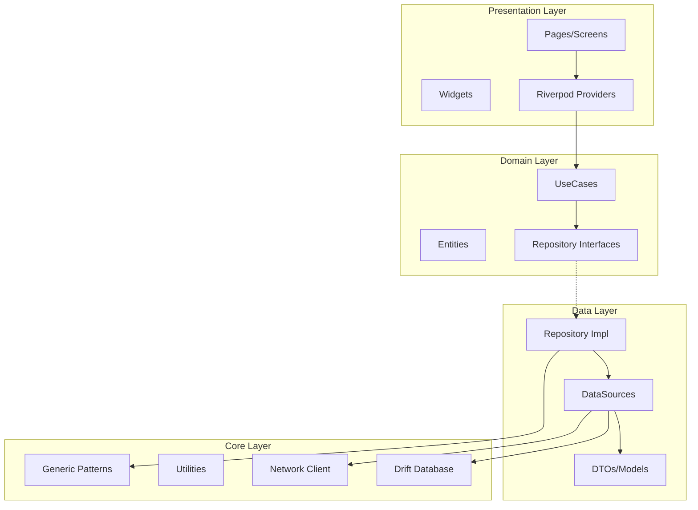

# Design Document: Flutter Production Ready 2025

## Overview

Este documento descreve o design técnico para garantir que o Flutter Base 2025 esteja no estado da arte e 100% pronto para produção. O projeto já possui uma base sólida com padrões genéricos, Result type, e arquitetura limpa. Este design foca em consolidar, testar e otimizar os componentes existentes.

## Architecture

O projeto segue Clean Architecture com três camadas principais:



## Components and Interfaces

### 1. Generic Repository Pattern

```dart
/// Base interface for all repositories
abstract interface class BaseRepository<T, ID> {
  Future<Result<T>> getById(ID id);
  Future<Result<PaginatedList<T>>> getAll({int page, int pageSize});
  Future<Result<T>> create(T entity);
  Future<Result<T>> update(T entity);
  Future<Result<void>> delete(ID id);
  Stream<List<T>> watchAll();
}

/// API repository with DTO mapping
abstract class ApiRepository<T, D, ID> {
  T fromDto(D dto);
  D toDto(T entity);
  D dtoFromJson(Map<String, dynamic> json);
  ID getId(T entity);
}

/// Cache repository with TTL
abstract interface class CacheRepository<T> {
  Future<T?> get(String key);
  Future<void> set(String key, T value, {Duration? ttl});
  Future<void> invalidate(String key);
  Future<void> clear();
}
```

### 2. Result Type with Combinators

```dart
sealed class Result<T> {
  // Core operations
  R fold<R>(R Function(AppFailure) onFailure, R Function(T) onSuccess);
  Result<R> map<R>(R Function(T) mapper);
  Result<R> flatMap<R>(Result<R> Function(T) mapper);
  
  // Async operations
  Future<Result<R>> mapAsync<R>(Future<R> Function(T) mapper);
  Future<Result<R>> flatMapAsync<R>(Future<Result<R>> Function(T) mapper);
  
  // Recovery
  Result<T> recover(T Function(AppFailure) recovery);
  Result<T> orElse(Result<T> Function() alternative);
  
  // Side effects
  Result<T> tap(void Function(T) action);
  Result<T> tapFailure(void Function(AppFailure) action);
  
  // Combinators
  static Result<(A, B)> zip<A, B>(Result<A> a, Result<B> b);
  static Result<List<T>> sequence<T>(List<Result<T>> results);
}
```

### 3. Validation System

```dart
sealed class ValidationResult<T> {
  bool get isValid;
  R fold<R>(R Function(Map<String, List<String>>) onInvalid, R Function(T) onValid);
  ValidationResult<R> map<R>(R Function(T) mapper);
  ValidationResult<R> flatMap<R>(ValidationResult<R> Function(T) mapper);
}

abstract final class TypedValidators {
  static Validator<String> required({String field, String? message});
  static Validator<String> email({String field, String? message});
  static Validator<String> minLength(int length, {String field});
  static Validator<T> compose<T>(List<Validator<T>> validators);
  static Validator<T> composeFailFast<T>(List<Validator<T>> validators);
  static Validator<List<T>> listOf<T>(Validator<T> itemValidator);
}
```

### 4. Pagination Notifier

```dart
abstract class PaginationNotifier<T> extends Notifier<PaginationState<T>> {
  Future<Result<PaginatedList<T>>> fetchPage(int page, int pageSize);
  Future<void> loadInitial();
  Future<void> loadMore();
  Future<void> refresh();
  void reset();
}

class PaginationState<T> {
  final List<T> items;
  final int currentPage;
  final int pageSize;
  final int totalItems;
  final bool isLoading;
  final bool isLoadingMore;
  final bool hasMore;
  final Object? error;
}
```

### 5. Accessibility Widgets

```dart
class AccessibleButton extends StatelessWidget {
  final VoidCallback? onPressed;
  final Widget child;
  final String? semanticLabel;
  final double minWidth; // >= 48.0
  final double minHeight; // >= 48.0
}

class AccessibleImage extends StatelessWidget {
  final ImageProvider image;
  final String semanticLabel; // Required
}

extension ColorContrastExtension on Color {
  double get relativeLuminance;
  double contrastRatio(Color other);
  bool meetsWcagAA(Color background); // >= 4.5:1
  bool meetsWcagAAA(Color background); // >= 7:1
}
```

## Data Models

### AppFailure Hierarchy

```dart
sealed class AppFailure extends Equatable {
  final String message;
  final String? code;
  final StackTrace? stackTrace;
  String get userMessage;
}

final class NetworkFailure extends AppFailure {}
final class CacheFailure extends AppFailure {}
final class ValidationFailure extends AppFailure {
  final Map<String, List<String>> fieldErrors;
}
final class AuthFailure extends AppFailure {}
final class ServerFailure extends AppFailure {
  final int? statusCode;
}
final class NotFoundFailure extends AppFailure {}
final class ForbiddenFailure extends AppFailure {}
final class ConflictFailure extends AppFailure {}
final class RateLimitFailure extends AppFailure {}
final class UnexpectedFailure extends AppFailure {}
```

### DTO Pattern with Freezed

```dart
@freezed
class UserDto with _$UserDto {
  const factory UserDto({
    required String id,
    required String email,
    required String name,
    required DateTime createdAt,
    DateTime? updatedAt,
  }) = _UserDto;

  factory UserDto.fromJson(Map<String, dynamic> json) => _$UserDtoFromJson(json);
}
```

## Correctness Properties

*A property is a characteristic or behavior that should hold true across all valid executions of a system-essentially, a formal statement about what the system should do. Properties serve as the bridge between human-readable specifications and machine-verifiable correctness guarantees.*

Based on the prework analysis, the following correctness properties must be verified through property-based testing:

### Property 1: Result Success Value Preservation
*For any* value `v` of type `T`, wrapping it in `Success(v)` and extracting via `valueOrNull` should return `v`.
**Validates: Requirements 2.1**

### Property 2: Result Failure Preservation
*For any* `AppFailure` `f`, wrapping it in `Failure(f)` and extracting via `failureOrNull` should return `f`.
**Validates: Requirements 2.2**

### Property 3: Result Map Identity Law
*For any* `Result<T>` `r`, `r.map((x) => x)` should equal `r`.
**Validates: Requirements 2.3**

### Property 4: Result Map Composition Law
*For any* `Result<T>` `r` and functions `f`, `g`, `r.map(f).map(g)` should equal `r.map((x) => g(f(x)))`.
**Validates: Requirements 2.3**

### Property 5: Result Zip Success Propagation
*For any* two `Success` values `Success(a)` and `Success(b)`, `Result.zip(Success(a), Success(b))` should equal `Success((a, b))`.
**Validates: Requirements 2.4**

### Property 6: Result Zip Failure Propagation
*For any* `Failure(f)` and any `Result r`, `Result.zip(Failure(f), r)` should be a `Failure`.
**Validates: Requirements 2.4**

### Property 7: Result Recover from Failure
*For any* `Failure(f)` and recovery function `rec`, `Failure(f).recover(rec)` should equal `Success(rec(f))`.
**Validates: Requirements 2.5**

### Property 8: Result Tap Preserves Value
*For any* `Result<T>` `r`, `r.tap((_) {})` should equal `r`.
**Validates: Requirements 2.6**

### Property 9: Validation Result Exhaustiveness
*For any* input and validator, the result is exactly one of `Valid` or `Invalid`.
**Validates: Requirements 3.1**

### Property 10: Invalid Contains Field Errors
*For any* `Invalid` result, the `errors` map should be non-empty.
**Validates: Requirements 3.2**

### Property 11: Compose Aggregates All Errors
*For any* list of validators where multiple fail, `compose` should return all errors from all failing validators.
**Validates: Requirements 3.3**

### Property 12: ComposeFailFast Returns First Error Only
*For any* list of validators where multiple fail, `composeFailFast` should return errors from only the first failing validator.
**Validates: Requirements 3.4**

### Property 13: ListOf Validator Indexed Errors
*For any* list with invalid items at indices `i`, the errors should have keys matching `[$i].*` pattern.
**Validates: Requirements 3.5**

### Property 14: Pagination LoadMore Increases Items
*For any* `PaginationState` with `hasMore=true`, calling `loadMore` with successful fetch should increase `items.length`.
**Validates: Requirements 4.2**

### Property 15: DTO Round-Trip Serialization
*For any* DTO instance `d`, `DtoClass.fromJson(d.toJson())` should equal `d`.
**Validates: Requirements 1.5, 8.3**

### Property 16: Entity-DTO Round-Trip Mapping
*For any* entity `e`, `fromDto(toDto(e))` should produce an equivalent entity.
**Validates: Requirements 1.3**

### Property 17: Accessible Button Minimum Size
*For any* `AccessibleButton`, `minWidth >= 48.0` and `minHeight >= 48.0`.
**Validates: Requirements 7.1**

### Property 18: Accessible Image Has Label
*For any* `AccessibleImage`, `semanticLabel.isNotEmpty` should be true.
**Validates: Requirements 7.2**

### Property 19: WCAG Contrast Ratio Calculation
*For any* two colors `c1` and `c2`, `c1.contrastRatio(c2)` should equal `c2.contrastRatio(c1)` (symmetry).
**Validates: Requirements 7.3**

### Property 20: WCAG AA Threshold
*For any* two colors where `contrastRatio >= 4.5`, `meetsWcagAA` should return true.
**Validates: Requirements 7.3**

### Property 21: Exception to Failure Mapping
*For any* `AppException` `e`, mapping to `AppFailure` should produce the correct subtype.
**Validates: Requirements 11.1**

### Property 22: Generator Produces Valid Instances
*For any* custom `Arbitrary<T>` generator, all generated values should satisfy type constraints.
**Validates: Requirements 8.2**

## Error Handling

### Exception to Failure Mapping

```dart
AppFailure mapExceptionToFailure(AppException e) {
  return switch (e) {
    NetworkException() => NetworkFailure(e.message),
    ServerException(:final statusCode) => ServerFailure(e.message, statusCode: statusCode),
    ValidationException(:final fieldErrors) => ValidationFailure(e.message, fieldErrors: fieldErrors ?? {}),
    UnauthorizedException() => AuthFailure(e.message),
    ForbiddenException() => ForbiddenFailure(e.message),
    NotFoundException() => NotFoundFailure(e.message),
    RateLimitException() => RateLimitFailure(e.message),
    CacheException() => CacheFailure(e.message),
  };
}
```

### User-Friendly Messages

Each `AppFailure` subclass provides a `userMessage` getter that returns a localized, user-friendly message suitable for display in the UI.

## Testing Strategy

### Dual Testing Approach

The project uses both unit tests and property-based tests:

1. **Unit Tests**: Verify specific examples, edge cases, and integration points
2. **Property-Based Tests**: Verify universal properties across all valid inputs

### Property-Based Testing with Glados

```dart
// Example property test
Glados(any.user).test('DTO round-trip preserves entity', (user) {
  // **Feature: flutter-production-ready-2025, Property 15: DTO Round-Trip Serialization**
  // **Validates: Requirements 1.5, 8.3**
  final dto = UserDto.fromEntity(user);
  final json = dto.toJson();
  final restored = UserDto.fromJson(json);
  expect(restored, equals(dto));
});
```

### Test Configuration

- Minimum 100 iterations per property test
- Custom generators for domain types in `test/helpers/generators.dart`
- Property tests annotated with requirement references

### Test Organization

```
test/
├── helpers/
│   ├── generators.dart      # Custom Arbitrary<T> generators
│   ├── mocks.dart           # Mock implementations
│   └── test_helpers.dart    # Test utilities
├── property/
│   ├── result_test.dart     # Result type properties
│   ├── validation_test.dart # Validation properties
│   ├── dto_test.dart        # DTO round-trip properties
│   └── accessibility_test.dart # WCAG properties
└── unit/
    ├── core/
    └── features/
```
