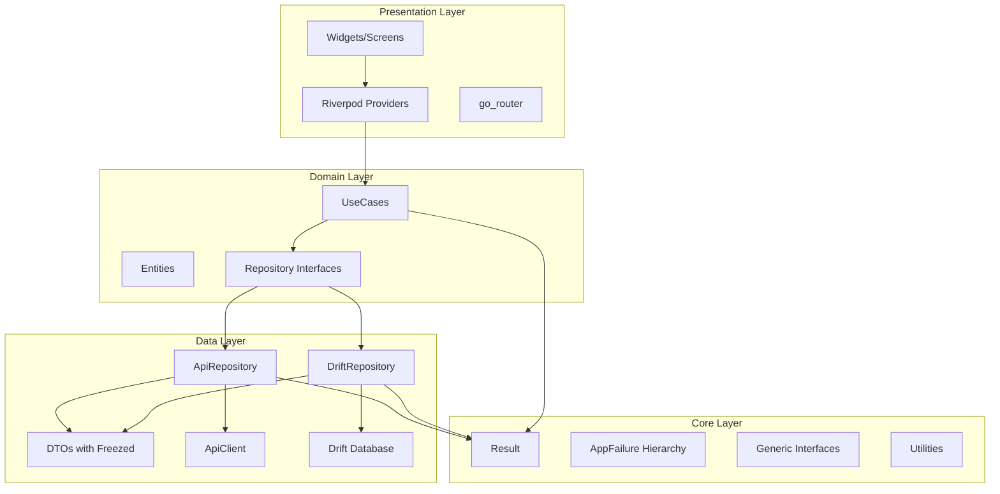

# Design Document

## Overview

Este documento descreve a arquitetura e design técnico para o Flutter Base 2025 - um template "Estado da Arte" para desenvolvimento de aplicações Flutter. O projeto segue Clean Architecture com foco em Generics<T>, SOLID, DRY, YAGNI e Property-Based Testing.

### Objetivos Principais
- **100% Generics**: Todas as abstrações usam tipos parametrizados
- **Clean Architecture**: Separação clara entre Domain, Data e Presentation
- **Property-Based Testing**: Validação de propriedades com Glados
- **Production Ready**: Configuração completa para deploy

## Architecture



### Camadas

1. **Core Layer**: Tipos genéricos, Result<T>, AppFailure, utilities
2. **Domain Layer**: Entities, UseCases, Repository interfaces
3. **Data Layer**: DTOs, Repository implementations, API client, Database
4. **Presentation Layer**: Widgets, Providers, Router

## Components and Interfaces

### 1. Generic Repository Pattern

```dart
/// Base repository interface - T = Entity, ID = Identifier type
abstract interface class BaseRepository<T, ID> {
  Future<Result<T>> getById(ID id);
  Future<Result<PaginatedList<T>>> getAll({int page, int pageSize, Filter<T>? filter, Sort<T>? sort});
  Future<Result<T>> create(T entity);
  Future<Result<T>> update(T entity);
  Future<Result<void>> delete(ID id);
  Future<Result<List<T>>> createMany(List<T> entities);
  Future<Result<void>> deleteMany(List<ID> ids);
  Stream<List<T>> watchAll();
}

/// API repository - T = Entity, D = DTO, ID = Identifier
abstract class ApiRepository<T, D, ID> {
  T fromDto(D dto);
  D toDto(T entity);
  D dtoFromJson(Map<String, dynamic> json);
  ID getId(T entity);
}

/// Drift repository - T = Entity, TableClass = Drift table
abstract class DriftRepository<T, TableClass extends Table> {
  T fromRow(DataClass row);
  Insertable<DataClass> toCompanion(T entity);
}

/// Cache repository with TTL
abstract class CacheRepository<T, ID> {
  Future<Result<T>> getOrFetch(ID id, Future<Result<T>> Function() fetcher);
  Future<void> invalidate(ID id);
  Future<void> invalidateAll();
}
```

### 2. Generic UseCase Pattern

```dart
/// UseCase with parameters
abstract interface class UseCase<Params, R> {
  Future<Result<R>> call(Params params);
}

/// UseCase without parameters
abstract interface class NoParamsUseCase<R> {
  Future<Result<R>> call();
}

/// Streaming UseCase
abstract interface class StreamUseCase<Params, R> {
  Stream<Result<R>> call(Params params);
}
```

### 3. Result Type (Monad)

```dart
sealed class Result<T> {
  // Monad operations
  Result<R> map<R>(R Function(T) mapper);
  Result<R> flatMap<R>(Result<R> Function(T) mapper);
  
  // Async operations
  Future<Result<R>> mapAsync<R>(Future<R> Function(T) mapper);
  Future<Result<R>> flatMapAsync<R>(Future<Result<R>> Function(T) mapper);
  
  // Combinators
  static Result<(A, B)> zip<A, B>(Result<A> a, Result<B> b);
  static Result<List<T>> sequence<T>(List<Result<T>> results);
  static Result<List<R>> traverse<T, R>(List<T> items, Result<R> Function(T) fn);
}

final class Success<T> extends Result<T> { final T value; }
final class Failure<T> extends Result<T> { final AppFailure failure; }
```

### 4. Error Hierarchy

```dart
sealed class AppFailure extends Equatable {
  final String message;
  final String? code;
  final StackTrace? stackTrace;
  final Map<String, dynamic>? context;
  String get userMessage;
}

final class NetworkFailure extends AppFailure {}
final class CacheFailure extends AppFailure {}
final class ValidationFailure extends AppFailure {
  final Map<String, List<String>> fieldErrors;
}
final class AuthFailure extends AppFailure {}
final class ServerFailure extends AppFailure { final int? statusCode; }
final class NotFoundFailure extends AppFailure {}
final class ForbiddenFailure extends AppFailure {}
final class ConflictFailure extends AppFailure {}
final class RateLimitFailure extends AppFailure { final Duration? retryAfter; }
final class UnexpectedFailure extends AppFailure {}
```

### 5. Generic Pagination

```dart
class PaginatedList<T> {
  final List<T> items;
  final int page;
  final int pageSize;
  final int totalItems;
  
  int get totalPages => (totalItems / pageSize).ceil();
  bool get hasMore => page < totalPages;
  bool get isEmpty => items.isEmpty;
}

class PaginationNotifier<T> extends AsyncNotifier<PaginatedList<T>> {
  Future<void> loadMore();
  Future<void> refresh();
  void reset();
}
```

### 6. Generic Validator

```dart
abstract interface class Validator<T> {
  ValidationResult validate(T value);
}

class ValidationResult {
  final bool isValid;
  final Map<String, List<String>> errors;
}

class CompositeValidator<T> implements Validator<T> {
  final List<Validator<T>> validators;
  ValidationResult validate(T value) => validators.fold(...);
}
```

## Data Models

### Entity Base

```dart
abstract class Entity<ID> {
  ID get id;
  DateTime get createdAt;
  DateTime? get updatedAt;
}
```

### DTO Base with Freezed

```dart
@freezed
class ExampleDto with _$ExampleDto {
  const ExampleDto._();
  
  const factory ExampleDto({
    required String id,
    required String name,
    @JsonKey(name: 'created_at') required DateTime createdAt,
    @JsonKey(name: 'updated_at') DateTime? updatedAt,
  }) = _ExampleDto;
  
  factory ExampleDto.fromJson(Map<String, dynamic> json) => _$ExampleDtoFromJson(json);
  
  ExampleEntity toEntity() => ExampleEntity(...);
  factory ExampleDto.fromEntity(ExampleEntity e) => ExampleDto(...);
}
```

### Database Table Base

```dart
mixin BaseTableMixin on Table {
  TextColumn get id => text()();
  DateTimeColumn get createdAt => dateTime().withDefault(currentDateAndTime)();
  DateTimeColumn get updatedAt => dateTime().nullable()();
  BoolColumn get isSynced => boolean().withDefault(const Constant(false))();
  
  @override
  Set<Column> get primaryKey => {id};
}
```

## Correctness Properties

*A property is a characteristic or behavior that should hold true across all valid executions of a system-essentially, a formal statement about what the system should do. Properties serve as the bridge between human-readable specifications and machine-verifiable correctness guarantees.*

### Property 1: Result Monad Left Identity
*For any* value `a` and function `f: A -> Result<B>`, `Success(a).flatMap(f)` should equal `f(a)`
**Validates: Requirements 3.1**

### Property 2: Result Monad Right Identity
*For any* Result `m`, `m.flatMap(Success)` should equal `m`
**Validates: Requirements 3.2**

### Property 3: Result Monad Associativity
*For any* Result `m` and functions `f`, `g`, `(m.flatMap(f)).flatMap(g)` should equal `m.flatMap(x => f(x).flatMap(g))`
**Validates: Requirements 3.3**

### Property 4: Failure Propagation
*For any* Failure `f` and function `mapper`, `f.map(mapper)` and `f.flatMap(mapper)` should preserve the original failure
**Validates: Requirements 3.4**

### Property 5: DTO JSON Round-Trip
*For any* valid DTO instance, `DTO.fromJson(dto.toJson())` should produce an equivalent DTO
**Validates: Requirements 4.1**

### Property 6: Entity-DTO Round-Trip
*For any* valid Entity, `DTO.fromEntity(entity).toEntity()` should produce an equivalent Entity
**Validates: Requirements 4.2**

### Property 7: PaginatedList hasMore Calculation
*For any* PaginatedList with `page`, `pageSize`, and `totalItems`, `hasMore` should be true if and only if `page * pageSize < totalItems`
**Validates: Requirements 5.1, 5.3**

### Property 8: Pagination Failure Preserves Items
*For any* PaginationNotifier with loaded items, a failed loadMore should preserve the existing items
**Validates: Requirements 5.4**

### Property 9: Exception to Failure Mapping
*For any* DioException type, the ApiClient should map it to the correct AppException subtype
**Validates: Requirements 6.3**

### Property 10: HTTP Status to Exception Mapping
*For any* HTTP status code, the ApiClient should create the correct exception type (4xx -> client errors, 5xx -> ServerException)
**Validates: Requirements 6.4**

### Property 11: ValidationFailure Field Errors
*For any* ValidationFailure with fieldErrors, `errorsFor(field)` should return the errors for that field or empty list
**Validates: Requirements 7.3**

### Property 12: Theme Contrast Ratio
*For any* foreground/background color pair in the theme, the contrast ratio should be at least 4.5:1 for WCAG AA
**Validates: Requirements 11.3**

### Property 13: Cache TTL Expiration
*For any* cached item with TTL, after TTL expires, `getOrFetch` should call the fetcher function
**Validates: Requirements 1.5**

### Property 14: Validator Composition
*For any* list of validators, CompositeValidator should return invalid if any validator returns invalid
**Validates: Requirements 13.2**

## Error Handling

### Exception to Failure Mapping

```dart
AppFailure mapExceptionToFailure(AppException e) {
  return switch (e) {
    NetworkException() => NetworkFailure(e.message),
    ServerException(:final statusCode) => ServerFailure(e.message, statusCode: statusCode),
    ValidationException(:final fieldErrors) => ValidationFailure(e.message, fieldErrors: fieldErrors ?? {}),
    UnauthorizedException() => AuthFailure(e.message),
    ForbiddenException() => ForbiddenFailure(e.message),
    NotFoundException() => NotFoundFailure(e.message),
    RateLimitException() => RateLimitFailure(e.message),
    CacheException() => CacheFailure(e.message),
  };
}
```

### Global Error Handler

```dart
void handleError(AppFailure failure, {required BuildContext context}) {
  switch (failure) {
    case AuthFailure():
      // Redirect to login
      context.go('/login');
    case ValidationFailure(:final fieldErrors):
      // Show field errors in form
      showValidationErrors(context, fieldErrors);
    case NetworkFailure():
      // Show offline indicator
      showOfflineSnackbar(context);
    default:
      // Show generic error
      showErrorSnackbar(context, failure.userMessage);
  }
}
```

## Testing Strategy

### Dual Testing Approach

O projeto utiliza duas abordagens complementares de teste:

1. **Unit Tests**: Verificam exemplos específicos e edge cases
2. **Property-Based Tests**: Verificam propriedades universais com Glados

### Property-Based Testing com Glados

```dart
// Configuração mínima de 100 iterações
Glados<UserDto>(iterations: 100).test(
  'DTO JSON round-trip preserves equality',
  (dto) {
    final json = dto.toJson();
    final restored = UserDto.fromJson(json);
    expect(restored, equals(dto));
  },
);
```

### Custom Generators

```dart
extension CustomGenerators on Any {
  Arbitrary<String> get nonEmptyLetters => any.letterOrDigits.where((s) => s.isNotEmpty);
  Arbitrary<String> get email => any.nonEmptyLetters.map((s) => '$s@test.com');
  Arbitrary<User> get user => combine4(any.nonEmptyLetters, any.email, any.nonEmptyLetters, any.dateTime, User.new);
  Arbitrary<Result<T>> result<T>(Arbitrary<T> valueGen) => any.bool.flatMap(
    (isSuccess) => isSuccess 
      ? valueGen.map(Success.new) 
      : any.letters.map((m) => Failure(NetworkFailure(m))),
  );
}
```

### Test Organization

```
test/
├── helpers/
│   ├── generators.dart      # Custom Glados generators
│   ├── mocks.dart           # Mocktail mocks
│   └── test_utils.dart      # Test utilities
├── property/
│   ├── result_test.dart     # Result monad laws
│   ├── dto_test.dart        # DTO round-trip
│   ├── pagination_test.dart # Pagination properties
│   └── validation_test.dart # Validator properties
├── unit/
│   ├── api_client_test.dart
│   ├── repository_test.dart
│   └── usecase_test.dart
└── widget/
    ├── form_test.dart
    └── theme_test.dart
```

### Test Annotations

Cada property test deve ser anotado com:
```dart
/// **Feature: flutter-state-of-art-2025-final, Property {number}: {property_text}**
/// **Validates: Requirements X.Y**
```

