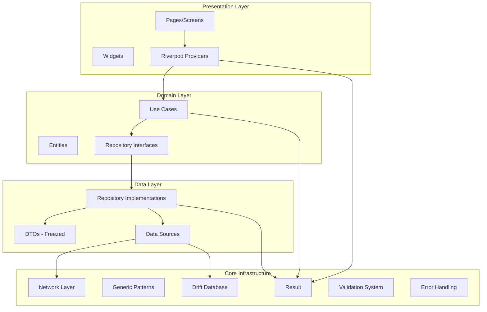
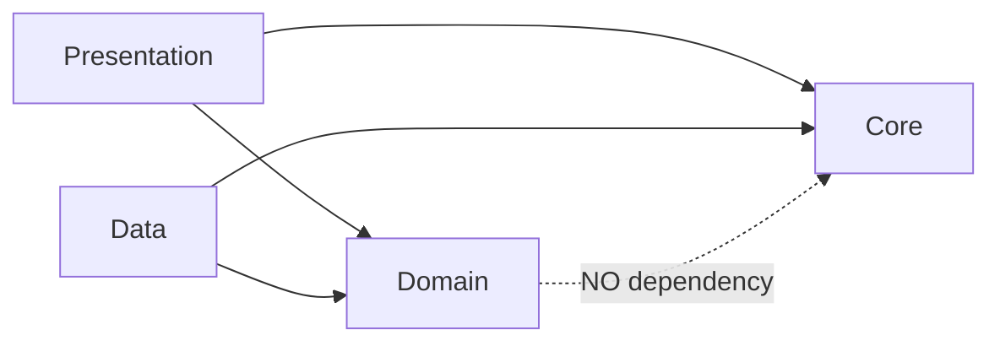
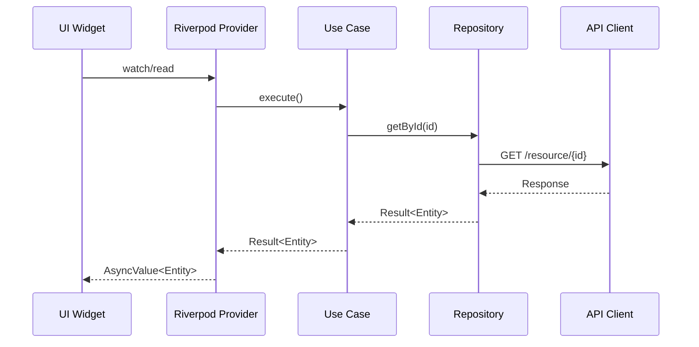
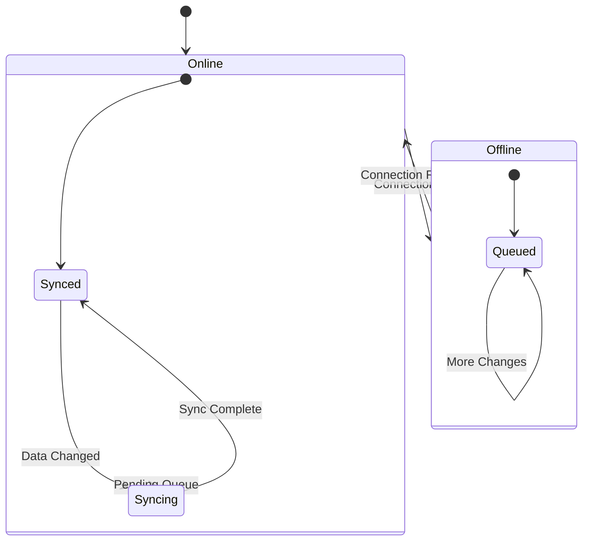

# Design Document: Flutter State of Art 2025 Review

## Overview

Este documento descreve o design técnico para a revisão completa do projeto Flutter Base 2025, garantindo conformidade com as melhores práticas de desenvolvimento Flutter em 2025. O objetivo é validar e aprimorar a arquitetura existente, padrões genéricos, e infraestrutura de testes.

A revisão foca em:
- Validação da arquitetura Clean Architecture com camadas bem definidas
- Padrões genéricos (Result<T>, BaseRepository<T,ID>, PaginatedList<T>)
- Property-Based Testing com Glados
- Conformidade WCAG 2.2 para acessibilidade
- Stack de produção com Docker (Sentry, Loki, Nginx)

## Architecture



### Layer Dependencies



## Components and Interfaces

### 1. Result<T> Pattern

```dart
sealed class Result<T> {
  // Functor operations
  Result<R> map<R>(R Function(T) mapper);
  
  // Monad operations
  Result<R> flatMap<R>(Result<R> Function(T) mapper);
  
  // Fold for pattern matching
  R fold<R>(R Function(AppFailure) onFailure, R Function(T) onSuccess);
  
  // Combinators
  static Result<(A, B)> zip<A, B>(Result<A> a, Result<B> b);
  static Result<List<T>> sequence<T>(List<Result<T>> results);
}

final class Success<T> extends Result<T> { final T value; }
final class Failure<T> extends Result<T> { final AppFailure failure; }
```

### 2. Generic Repository Pattern

```dart
abstract interface class BaseRepository<T, ID> {
  Future<Result<T>> getById(ID id);
  Future<Result<PaginatedList<T>>> getAll({
    int page = 1,
    int pageSize = 20,
    Filter<T>? filter,
    Sort<T>? sort,
  });
  Future<Result<T>> create(T entity);
  Future<Result<T>> update(T entity);
  Future<Result<void>> delete(ID id);
  Stream<List<T>> watchAll();
}

abstract class ApiRepository<T, D, ID> {
  T fromDto(D dto);
  D toDto(T entity);
  D dtoFromJson(Map<String, dynamic> json);
  ID getId(T entity);
}
```

### 3. Validation System

```dart
sealed class ValidationResult<T> {
  bool get isValid;
  R fold<R>(
    R Function(Map<String, List<String>>) onInvalid,
    R Function(T) onValid,
  );
}

final class Valid<T> extends ValidationResult<T> { final T value; }
final class Invalid<T> extends ValidationResult<T> { 
  final Map<String, List<String>> errors; 
}

abstract final class TypedValidators {
  static Validator<T> compose<T>(List<Validator<T>> validators);
  static Validator<String> required({String field, String? message});
  static Validator<String> email({String field, String? message});
  static Validator<String> minLength(int length, {String field});
  static Validator<String> maxLength(int length, {String field});
}
```

### 4. Error Handling

```dart
sealed class AppFailure extends Equatable {
  final String message;
  final String? code;
  final StackTrace? stackTrace;
  final Map<String, dynamic>? context;
  
  String get userMessage;
}

// Specific failure types
final class NetworkFailure extends AppFailure {}
final class ValidationFailure extends AppFailure {}
final class AuthFailure extends AppFailure {}
final class ServerFailure extends AppFailure {}
final class NotFoundFailure extends AppFailure {}
final class CacheFailure extends AppFailure {}
```

### 5. Accessibility Utilities

```dart
class AccessibilityUtils {
  /// Calculates contrast ratio using WCAG 2.1 formula
  static double contrastRatio(Color foreground, Color background);
  
  /// Calculates relative luminance per WCAG 2.1
  static double relativeLuminance(Color color);
  
  /// Checks if contrast meets WCAG AA (4.5:1 for normal text)
  static bool meetsWcagAA(Color foreground, Color background);
}
```

## Data Models

### User DTO (Example)

```dart
@freezed
class UserDto with _$UserDto {
  const factory UserDto({
    required String id,
    required String email,
    required String name,
    @JsonKey(name: 'avatar_url') String? avatarUrl,
    @JsonKey(name: 'created_at') required DateTime createdAt,
  }) = _UserDto;

  factory UserDto.fromJson(Map<String, dynamic> json) => _$UserDtoFromJson(json);
  
  User toEntity();
  factory UserDto.fromEntity(User user);
}
```

### PaginatedList<T>

```dart
class PaginatedList<T> {
  final List<T> items;
  final int page;
  final int pageSize;
  final int totalItems;
  final int totalPages;
  
  bool get hasNextPage;
  bool get hasPreviousPage;
  bool get isEmpty;
}
```

## Correctness Properties

*A property is a characteristic or behavior that should hold true across all valid executions of a system-essentially, a formal statement about what the system should do. Properties serve as the bridge between human-readable specifications and machine-verifiable correctness guarantees.*

Based on the prework analysis, the following correctness properties were identified:

### Property 1: Result Monad Laws
*For any* value `a` and functions `f: A -> Result<B>` and `g: B -> Result<C>`:
- Left Identity: `Success(a).flatMap(f) == f(a)`
- Right Identity: `m.flatMap(Success) == m`
- Associativity: `m.flatMap(f).flatMap(g) == m.flatMap(x => f(x).flatMap(g))`

**Validates: Requirements 3.4**

### Property 2: Result Map Preserves Structure
*For any* Result<T> and identity function `id`, `result.map(id) == result`
*For any* Result<T> and functions `f` and `g`, `result.map(f).map(g) == result.map(x => g(f(x)))`

**Validates: Requirements 3.2**

### Property 3: Result Zip/Sequence Semantics
*For any* list of Results, `Result.sequence` returns Success only if all inputs are Success, otherwise returns the first Failure.

**Validates: Requirements 3.3**

### Property 4: DTO Round-Trip Serialization
*For any* valid DTO instance, `fromJson(toJson(dto)) == dto`

**Validates: Requirements 7.3**

### Property 5: DTO Equality Properties
*For any* DTO instances a, b, c:
- Reflexivity: `a == a`
- Symmetry: `a == b` implies `b == a`
- Transitivity: `a == b` and `b == c` implies `a == c`
- Hash consistency: `a == b` implies `a.hashCode == b.hashCode`

**Validates: Requirements 7.5**

### Property 6: DTO CopyWith Preserves Unchanged Fields
*For any* DTO and field update, `dto.copyWith(field: newValue)` preserves all other fields unchanged.

**Validates: Requirements 7.4**

### Property 7: Validation Composition Aggregates Errors
*For any* list of validators and input value, `compose(validators)(value)` returns Invalid containing all errors from all failing validators.

**Validates: Requirements 11.3**

### Property 8: Validator Behavior Correctness
*For any* string input:
- `required` rejects empty/whitespace-only strings
- `email` accepts valid email format, rejects invalid
- `minLength(n)` rejects strings shorter than n
- `maxLength(n)` rejects strings longer than n

**Validates: Requirements 11.4**

### Property 9: Contrast Ratio WCAG Formula
*For any* two colors, the calculated contrast ratio matches the WCAG 2.1 formula:
`(L1 + 0.05) / (L2 + 0.05)` where L1 > L2 are relative luminances.

**Validates: Requirements 10.4**

### Property 10: Contrast Ratio Range
*For any* two colors, contrast ratio is between 1:1 (identical) and 21:1 (black/white).

**Validates: Requirements 10.3**

### Property 11: Exception to Failure Mapping Exhaustiveness
*For any* AppException type, the mapping function produces a corresponding AppFailure type.

**Validates: Requirements 12.3**

### Property 12: Failure UserMessage Non-Empty
*For any* AppFailure instance, `userMessage` is non-empty and suitable for UI display.

**Validates: Requirements 12.2**

### Property 13: PaginatedList Invariants
*For any* PaginatedList:
- `totalPages == ceil(totalItems / pageSize)`
- `hasNextPage == (page < totalPages)`
- `hasPreviousPage == (page > 1)`
- `items.length <= pageSize`

**Validates: Requirements 2.4**

### Property 14: Route Guard Redirect
*For any* protected route and unauthenticated state, navigation redirects to login.

**Validates: Requirements 8.4**

### Property 15: Offline Queue Persistence
*For any* data modification while offline, the change is queued for sync.

**Validates: Requirements 6.4**

### Property 16: Auth Interceptor Token Injection
*For any* authenticated request, the AuthInterceptor adds the authorization header with valid token.

**Validates: Requirements 5.2**

### Property 17: Retry Interceptor Behavior
*For any* retryable error (5xx, timeout), the RetryInterceptor retries up to configured max attempts.

**Validates: Requirements 5.3**

### Property 18: Network Error Mapping
*For any* network error type, the error is mapped to appropriate AppException subtype.

**Validates: Requirements 5.5**


## Error Handling

### Exception Hierarchy

```dart
sealed class AppException implements Exception {
  final String message;
  final int? statusCode;
}

final class NetworkException extends AppException {}
final class ServerException extends AppException {}
final class ValidationException extends AppException {}
final class UnauthorizedException extends AppException {}
final class ForbiddenException extends AppException {}
final class NotFoundException extends AppException {}
final class RateLimitException extends AppException {}
final class CacheException extends AppException {}
```

### Exception to Failure Mapping

```dart
AppFailure mapExceptionToFailure(AppException e) {
  return switch (e) {
    NetworkException() => NetworkFailure(e.message),
    ServerException() => ServerFailure(e.message, statusCode: e.statusCode),
    ValidationException(:final fieldErrors) => 
      ValidationFailure(e.message, fieldErrors: fieldErrors ?? {}),
    UnauthorizedException() => AuthFailure(e.message),
    ForbiddenException() => ForbiddenFailure(e.message),
    NotFoundException() => NotFoundFailure(e.message),
    RateLimitException() => RateLimitFailure(e.message),
    CacheException() => CacheFailure(e.message),
  };
}
```

### Error Boundary Widget

```dart
class ErrorBoundaryWidget extends StatefulWidget {
  final Widget child;
  final Widget Function(Object error, StackTrace? stack) errorBuilder;
  final void Function(Object error, StackTrace? stack)? onError;
}
```

## Testing Strategy

### Dual Testing Approach

O projeto utiliza duas abordagens complementares de teste:

1. **Unit Tests**: Verificam exemplos específicos, edge cases e condições de erro
2. **Property-Based Tests**: Verificam propriedades universais que devem valer para todas as entradas

### Property-Based Testing com Glados

```dart
// Configuração padrão: 100 iterações por teste
Glados<UserDto>(any.userDto).test('DTO round-trip', (dto) {
  final json = dto.toJson();
  final restored = UserDto.fromJson(json);
  expect(restored, equals(dto));
});
```

### Custom Generators

```dart
extension CustomGenerators on Any {
  Arbitrary<String> get email => 
    any.nonEmptyLetters.map((s) => '$s@test.com');
  
  Arbitrary<User> get user => combine4(
    any.nonEmptyLetters,
    any.email,
    any.nonEmptyLetters,
    any.dateTime,
    (id, email, name, createdAt) => User(...),
  );
}
```

### Test Organization

```
test/
├── helpers/
│   ├── generators.dart      # Custom Glados generators
│   ├── mocks.dart           # Mocktail mocks
│   └── test_helpers.dart    # Test utilities
├── property/
│   ├── result_test.dart     # Result monad laws
│   ├── dto_test.dart        # DTO round-trip
│   ├── validation_test.dart # Validator properties
│   └── accessibility_test.dart # WCAG properties
├── unit/
│   └── core/
│       └── errors/
│           └── failures_test.dart
└── golden/
    └── button_golden_test.dart
```

### Test Tagging Convention

Cada property test deve ser anotado com referência ao requisito:

```dart
/// **Feature: flutter-state-of-art-2025-review, Property 1: Result Monad Laws**
/// **Validates: Requirements 3.4**
test('Result left identity law', () { ... });
```

## Docker Production Stack

### Services

```yaml
services:
  flutter-web:
    build: .
    ports: ["80:80"]
    
  sentry:
    image: sentry:latest
    # Self-hosted crash reporting
    
  loki:
    image: grafana/loki:latest
    # Log aggregation
    
  nginx:
    image: nginx:alpine
    # Reverse proxy with SSL
```

### Health Checks

Todos os serviços devem expor endpoints de health check:
- `/health` - Status básico
- `/ready` - Readiness probe

## Diagrams

### State Management Flow



### Offline Sync Flow


