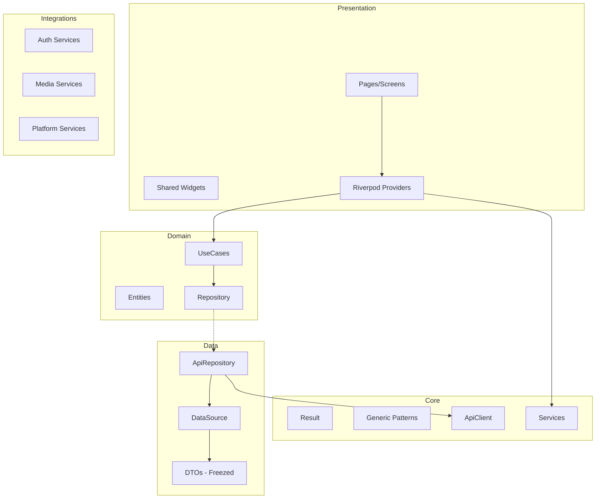
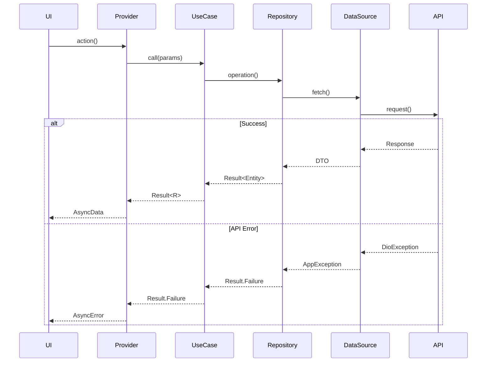

# Design Document: Flutter State of Art 2025

## Overview

Este documento descreve o design técnico para elevar o Flutter Base 2025 ao "Estado da Arte", implementando padrões genéricos type-safe, arquitetura limpa, e infraestrutura completa para produção.

O projeto segue a filosofia de **Frontend Puro** - consumindo APIs backend sem lógica de negócio local. O foco é em:
- Maximizar uso de Generics<T> para código reutilizável
- Padrões SOLID/DRY/KISS/YAGNI
- Property-Based Testing para garantir corretude
- Infraestrutura completa para apps production-ready

## Architecture



## Components and Interfaces

### 1. Generic Repository Pattern

```dart
/// Base repository interface with full CRUD operations
abstract interface class BaseRepository<T, ID> {
  Future<Result<T>> getById(ID id);
  Future<Result<PaginatedList<T>>> getAll({
    int page = 1,
    int pageSize = 20,
    Filter<T>? filter,
    Sort<T>? sort,
  });
  Future<Result<T>> create(T entity);
  Future<Result<T>> update(T entity);
  Future<Result<void>> delete(ID id);
  Future<Result<List<T>>> createMany(List<T> entities);
  Future<Result<void>> deleteMany(List<ID> ids);
  Stream<List<T>> watchAll();
}

/// API repository implementation with DTO mapping
abstract class ApiRepository<T, D, ID> {
  final ApiClient _apiClient;
  final String _basePath;
  
  T fromDto(D dto);
  D toDto(T entity);
  D dtoFromJson(Map<String, dynamic> json);
  ID getId(T entity);
}
```

### 2. Generic UseCase Pattern

```dart
/// Use case with parameters
abstract interface class UseCase<Params, R> {
  Future<Result<R>> call(Params params);
}

/// Use case without parameters
abstract interface class NoParamsUseCase<R> {
  Future<Result<R>> call();
}

/// Stream use case for reactive data
abstract interface class StreamUseCase<Params, R> {
  Stream<Result<R>> call(Params params);
}
```

### 3. Enhanced Result Type

```dart
sealed class Result<T> {
  // Core operations
  R fold<R>(R Function(AppFailure) onFailure, R Function(T) onSuccess);
  Result<R> map<R>(R Function(T) mapper);
  Result<R> flatMap<R>(Result<R> Function(T) mapper);
  
  // Async operations
  Future<Result<R>> mapAsync<R>(Future<R> Function(T) mapper);
  Future<Result<R>> flatMapAsync<R>(Future<Result<R>> Function(T) mapper);
  
  // Combinators
  Result<R> andThen<R>(Result<R> Function(T) next);
  Result<T> tap(void Function(T) action);
  Result<T> tapFailure(void Function(AppFailure) action);
  Result<T> recover(T Function(AppFailure) recovery);
  Result<T> orElse(Result<T> Function() alternative);
  
  // Static combinators
  static Result<(A, B)> zip<A, B>(Result<A> a, Result<B> b);
  static Result<(A, B, C)> zip3<A, B, C>(Result<A> a, Result<B> b, Result<C> c);
  static Result<List<T>> sequence<T>(List<Result<T>> results);
  static Result<List<R>> traverse<T, R>(List<T> items, Result<R> Function(T) fn);
}
```

### 4. Generic Pagination

```dart
/// Paginated list with metadata
class PaginatedList<T> {
  final List<T> items;
  final int page;
  final int pageSize;
  final int totalItems;
  
  bool get hasMore => items.length < totalItems;
  int get totalPages => (totalItems / pageSize).ceil();
}

/// Pagination notifier for infinite scroll
@riverpod
class PaginationNotifier<T> extends _$PaginationNotifier<T> {
  Future<void> loadMore();
  Future<void> refresh();
  void reset();
}
```

### 5. Generic Form Validation

```dart
/// Validator function type
typedef Validator<T> = ValidationResult<T> Function(T value);

/// Validation result
sealed class ValidationResult<T> {
  const ValidationResult();
}

final class Valid<T> extends ValidationResult<T> {
  final T value;
  const Valid(this.value);
}

final class Invalid<T> extends ValidationResult<T> {
  final Map<String, List<String>> errors;
  const Invalid(this.errors);
}

/// Composable validators
class Validators {
  static Validator<String> required([String? message]);
  static Validator<String> email([String? message]);
  static Validator<String> minLength(int length, [String? message]);
  static Validator<String> maxLength(int length, [String? message]);
  static Validator<String> pattern(RegExp regex, [String? message]);
  static Validator<T> compose<T>(List<Validator<T>> validators);
}
```

### 6. Generic DataSource Pattern

```dart
/// Remote data source interface
abstract interface class RemoteDataSource<T, D> {
  Future<D> get(String path);
  Future<List<D>> getList(String path);
  Future<PaginatedResponse<D>> getPaginated(String path, {int page, int pageSize});
  Future<D> post(String path, D data);
  Future<D> put(String path, D data);
  Future<void> delete(String path);
}

/// Local data source interface
abstract interface class LocalDataSource<T> {
  Future<T?> get(String key);
  Future<void> set(String key, T value);
  Future<void> delete(String key);
  Future<void> clear();
  Stream<T?> watch(String key);
}

/// Cache data source with TTL
abstract interface class CacheDataSource<T> {
  Future<T?> get(String key);
  Future<void> set(String key, T value, {Duration? ttl});
  Future<void> invalidate(String key);
  Future<void> invalidateAll();
}
```

## Data Models

### Failure Types (Sealed Classes)

```dart
sealed class AppFailure extends Equatable {
  final String message;
  final String? code;
  final StackTrace? stackTrace;
  final Map<String, dynamic>? context;
  
  String get userMessage;
}

final class NetworkFailure extends AppFailure { ... }
final class ServerFailure extends AppFailure { ... }
final class ValidationFailure extends AppFailure { ... }
final class AuthFailure extends AppFailure { ... }
final class NotFoundFailure extends AppFailure { ... }
final class ForbiddenFailure extends AppFailure { ... }
final class ConflictFailure extends AppFailure { ... }
final class RateLimitFailure extends AppFailure { ... }
final class CacheFailure extends AppFailure { ... }
final class UnexpectedFailure extends AppFailure { ... }
```

### Exception Types (Sealed Classes)

```dart
sealed class AppException implements Exception {
  final String message;
  final int? statusCode;
  final StackTrace? stackTrace;
}

final class NetworkException extends AppException { ... }
final class ServerException extends AppException { ... }
final class ValidationException extends AppException { ... }
final class UnauthorizedException extends AppException { ... }
final class ForbiddenException extends AppException { ... }
final class NotFoundException extends AppException { ... }
final class RateLimitException extends AppException { ... }
final class CacheException extends AppException { ... }
```

### DTO Pattern with Freezed

```dart
@freezed
class UserDto with _$UserDto {
  const factory UserDto({
    required String id,
    required String email,
    required String name,
    DateTime? createdAt,
    DateTime? updatedAt,
  }) = _UserDto;
  
  factory UserDto.fromJson(Map<String, dynamic> json) => _$UserDtoFromJson(json);
}
```

## Correctness Properties

*A property is a characteristic or behavior that should hold true across all valid executions of a system-essentially, a formal statement about what the system should do. Properties serve as the bridge between human-readable specifications and machine-verifiable correctness guarantees.*

Based on the prework analysis, the following properties are identified for property-based testing:

### Property 1: DTO Round-Trip Consistency
*For any* valid DTO instance, serializing to JSON and deserializing back should produce an equivalent DTO.
```
fromJson(toJson(dto)) == dto
```
**Validates: Requirements 1.5, 3.5, 10.3**

### Property 2: Entity-DTO Round-Trip Consistency
*For any* valid entity, converting to DTO and back should produce an equivalent entity.
```
fromDto(toDto(entity)) == entity
```
**Validates: Requirements 1.5**

### Property 3: Result Monad Left Identity
*For any* value `a` and function `f: A -> Result<B>`, wrapping `a` in Success and flatMapping with `f` should equal calling `f(a)` directly.
```
Success(a).flatMap(f) == f(a)
```
**Validates: Requirements 4.1, 10.4**

### Property 4: Result Monad Right Identity
*For any* Result `m`, flatMapping with Success constructor should return the same Result.
```
m.flatMap(Success.new) == m
```
**Validates: Requirements 4.1, 10.4**

### Property 5: Result Monad Associativity
*For any* Result `m` and functions `f`, `g`, chaining flatMaps should be associative.
```
m.flatMap(f).flatMap(g) == m.flatMap((x) => f(x).flatMap(g))
```
**Validates: Requirements 4.1, 10.4**

### Property 6: Result.zip Combines Successes
*For any* two Success values, zip should combine them into a tuple.
```
Result.zip(Success(a), Success(b)) == Success((a, b))
```
**Validates: Requirements 4.2**

### Property 7: Result.zip Propagates First Failure
*For any* Failure and any Result, zip should return the first Failure encountered.
```
Result.zip(Failure(f), Success(b)).isFailure == true
Result.zip(Success(a), Failure(f)).isFailure == true
```
**Validates: Requirements 4.2**

### Property 8: Result.sequence All Success
*For any* list of Success values, sequence should return Success with all values.
```
Result.sequence([Success(a), Success(b), Success(c)]) == Success([a, b, c])
```
**Validates: Requirements 4.3**

### Property 9: Result.sequence Any Failure
*For any* list containing at least one Failure, sequence should return that Failure.
```
Result.sequence([Success(a), Failure(f), Success(c)]).isFailure == true
```
**Validates: Requirements 4.3**

### Property 10: Result.tap Preserves Value
*For any* Result, tap should execute side effect but return the same Result.
```
result.tap(action) == result
```
**Validates: Requirements 4.4**

### Property 11: Result.recover Transforms Failure to Success
*For any* Failure, recover should transform it to Success with recovered value.
```
Failure(f).recover(recovery).isSuccess == true
```
**Validates: Requirements 4.5**

### Property 12: Result.recover Preserves Success
*For any* Success, recover should return the same Success unchanged.
```
Success(a).recover(recovery) == Success(a)
```
**Validates: Requirements 4.5**

### Property 13: PaginatedList.hasMore Calculation
*For any* PaginatedList, hasMore should be true only when current items count is less than totalItems.
```
paginatedList.hasMore == (paginatedList.items.length < paginatedList.totalItems)
```
**Validates: Requirements 5.1, 5.3**

### Property 14: Validator Whitespace Rejection
*For any* string composed entirely of whitespace, required validator should reject it.
```
Validators.required()(whitespaceString).isInvalid == true
```
**Validates: Requirements 6.5**

### Property 15: Validator Composition Aggregates Errors
*For any* input that fails multiple validators, composed validator should collect all errors.
```
Validators.compose([v1, v2, v3])(input).errors.length >= individualFailures
```
**Validates: Requirements 6.2, 6.3**

### Property 16: Exception to Failure Mapping Completeness
*For any* AppException subtype, mapping to AppFailure should produce the correct failure type.
```
mapExceptionToFailure(NetworkException(...)) is NetworkFailure
mapExceptionToFailure(ServerException(...)) is ServerFailure
// etc.
```
**Validates: Requirements 3.3**

### Property 17: Cache TTL Expiration
*For any* cached item with TTL, after TTL expires, get should return null.
```
cache.set(key, value, ttl: Duration.zero)
await Future.delayed(Duration(milliseconds: 1))
cache.get(key) == null
```
**Validates: Requirements 3.4**

### Property 18: Arbitrary Generator Validity
*For any* generated instance from Arbitrary<T>, the instance should be valid according to domain rules.
```
any.user.sample().isValid == true
```
**Validates: Requirements 10.2**

## Error Handling

### Strategy

1. **Exceptions** for infrastructure/programming errors - log and bubble up
2. **Result<T>** for expected business failures - handle gracefully
3. **Sealed classes** for exhaustive pattern matching

### Error Flow



### Error Boundary Widget

```dart
class ErrorBoundary extends StatefulWidget {
  final Widget child;
  final Widget Function(Object error, VoidCallback retry) errorBuilder;
  
  // Catches errors in child widget tree
  // Provides retry callback for recovery
  // Logs errors to crash reporting
}
```

## Testing Strategy

### Dual Testing Approach

1. **Unit Tests** - Specific examples and edge cases
2. **Property-Based Tests** - Universal properties across all inputs

### Property-Based Testing with Glados

```dart
/// Configuration
abstract final class PropertyTestConfig {
  static const int defaultIterations = 100;
  static const int minIterations = 50;
  static const int maxIterations = 500;
}

/// Custom generators
extension CustomGenerators on Any {
  Arbitrary<User> get user => combine4(
    any.nonEmptyLetters,
    any.email,
    any.nonEmptyLetters,
    any.dateTime,
    (id, email, name, createdAt) => User(
      id: id,
      email: email,
      name: name,
      createdAt: createdAt,
    ),
  );
  
  Arbitrary<UserDto> get userDto => ...;
}
```

### Test Structure

```
test/
├── helpers/
│   ├── generators.dart      # Glados generators
│   ├── mocks.dart           # Mocktail mocks
│   └── test_helpers.dart    # Common utilities
├── property/
│   ├── result_test.dart     # Result monad laws
│   ├── dto_test.dart        # Round-trip properties
│   ├── validation_test.dart # Validator properties
│   └── pagination_test.dart # Pagination properties
├── unit/
│   ├── core/
│   └── features/
└── golden/
    └── *.dart               # Golden tests
```

### Test Annotations

Each property test must be annotated with:
```dart
/// **Feature: flutter-state-of-art-2025, Property 1: DTO Round-Trip Consistency**
/// **Validates: Requirements 1.5, 3.5, 10.3**
```

## Service Interfaces

### WebSocket Service

```dart
abstract interface class WebSocketService<T> {
  Stream<ConnectionState> get connectionState;
  Stream<WebSocketMessage<T>> get messages;
  Future<void> connect(String url);
  Future<void> disconnect();
  Future<void> send(T message);
}
```

### Analytics Service

```dart
abstract interface class AnalyticsService {
  Future<void> track(AnalyticsEvent event, [Map<String, dynamic>? params]);
  Future<void> setUserId(String? userId);
  Future<void> setUserProperty(String name, String value);
  Future<void> logScreenView(String screenName);
}
```

### Feature Flags Service

```dart
abstract interface class FeatureFlagsService {
  Future<void> fetch();
  bool isEnabled(FeatureFlag flag);
  T getValue<T>(FeatureFlag flag, T defaultValue);
  Stream<void> get onUpdate;
}
```

### Biometric Service

```dart
abstract interface class BiometricService {
  Future<bool> isAvailable();
  Future<BiometricResult> authenticate({String? reason});
  Future<List<BiometricType>> getAvailableTypes();
}
```

## File Structure

```
lib/
├── core/
│   ├── config/
│   ├── constants/
│   ├── database/
│   ├── errors/
│   │   ├── exceptions.dart
│   │   └── failures.dart
│   ├── generics/
│   │   ├── api_repository.dart
│   │   ├── base_datasource.dart
│   │   ├── base_dto.dart
│   │   ├── base_repository.dart
│   │   ├── base_usecase.dart
│   │   ├── paginated_list.dart
│   │   └── paginated_response.dart
│   ├── network/
│   ├── observability/
│   ├── router/
│   ├── security/
│   ├── storage/
│   ├── theme/
│   └── utils/
│       ├── result.dart
│       ├── validators.dart
│       └── ...
├── features/
│   └── [feature]/
│       ├── data/
│       │   ├── datasources/
│       │   ├── models/
│       │   └── repositories/
│       ├── domain/
│       │   ├── entities/
│       │   ├── repositories/
│       │   └── usecases/
│       └── presentation/
│           ├── pages/
│           ├── providers/
│           └── widgets/
├── integrations/
│   ├── ai/
│   ├── auth/
│   ├── files/
│   ├── maps/
│   ├── media/
│   ├── notifications/
│   └── payments/
├── shared/
│   ├── providers/
│   └── widgets/
└── l10n/
```
