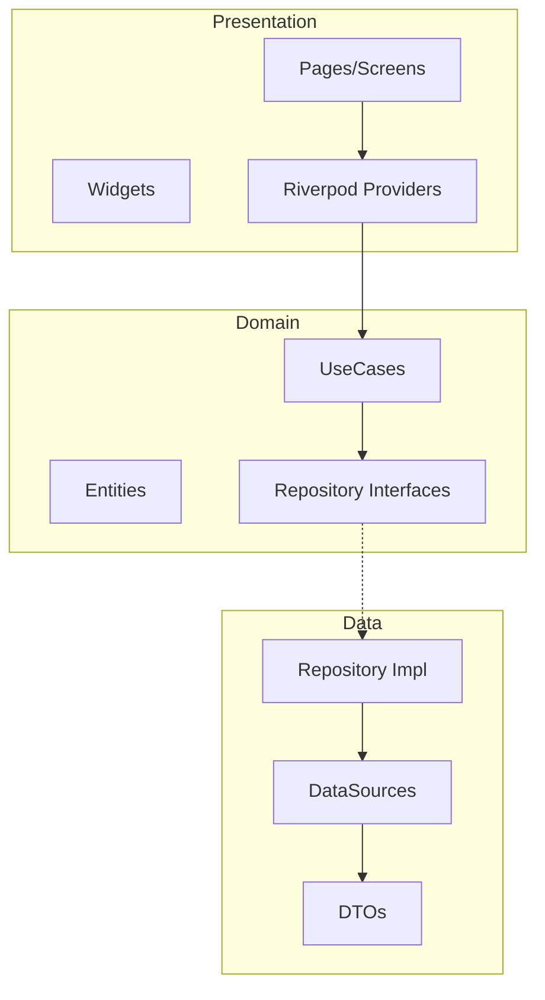

# Architecture

## Overview

Flutter Base 2025 é um **frontend puro** que consome uma API Python como backend.

```
┌─────────────────────────────────────────────────────────────┐
│                    FLUTTER (Frontend)                        │
│  ┌─────────────┐  ┌─────────────┐  ┌─────────────────────┐  │
│  │ Presentation│  │   Domain    │  │       Data          │  │
│  │  (Widgets)  │──│ (Entities)  │──│ (API Client/DTOs)   │  │
│  └─────────────┘  └─────────────┘  └─────────────────────┘  │
└─────────────────────────────────────────────────────────────┘
                              │
                              │ HTTP/REST
                              ▼
┌─────────────────────────────────────────────────────────────┐
│                    PYTHON API (Backend)                      │
└─────────────────────────────────────────────────────────────┘
```

## Clean Architecture



## Layer Rules

| Layer | Depends On | Contains |
|-------|------------|----------|
| Presentation | Domain, Core | Pages, Widgets, Providers |
| Domain | Nothing | Entities, UseCases, Repository Interfaces |
| Data | Domain, Core | Repository Impl, DataSources, DTOs |
| Core | Nothing | Utils, Config, Network, Theme |

## Key Patterns

### Result<T>
Todas operações retornam `Result<T>` com `Success` ou `Failure`.

```dart
// Combinators disponíveis
result.map((value) => transform(value))
result.flatMap((value) => anotherResult(value))
result.tap((value) => sideEffect(value))
result.recover((failure) => defaultValue)
Result.zip(result1, result2)
Result.sequence([result1, result2, result3])
```

### Generic Repository
`BaseRepository<T, ID>` com CRUD operations tipadas.

### PaginationNotifier<T>
Notifier genérico para infinite scroll com Riverpod.

```dart
abstract class PaginationNotifier<T> extends Notifier<PaginationState<T>> {
  Future<void> loadInitial();
  Future<void> loadMore();
  Future<void> refresh();
  void reset();
}
```

### CacheDataSource<T>
Cache com TTL e eviction automático.

```dart
abstract interface class CacheDataSource<T> {
  Future<T?> get(String key);
  Future<void> set(String key, T value, {Duration? ttl});
  Future<void> invalidate(String key);
}
```

### ValidationResult<T>
Validação type-safe com composição.

```dart
final validator = TypedValidators.compose<String>([
  TypedValidators.required(),
  TypedValidators.email(),
  TypedValidators.minLength(5),
]);
final result = validator(input); // Valid<String> ou Invalid<String>
```

### AsyncNotifier
Riverpod 3.0 para state management assíncrono.

### ExperimentService
A/B testing com variant assignment persistente.

```dart
final variant = experimentService.getVariant<String>('experiment_id');
await experimentService.trackExperimentEvent('experiment_id', 'conversion');
```

## Directory Structure

```
lib/
├── core/               # Infrastructure
│   ├── config/         # App configuration
│   ├── database/       # Drift database, sync repository
│   ├── errors/         # Failures and exceptions
│   ├── generics/       # Base classes
│   │   ├── api_repository.dart
│   │   ├── base_repository.dart
│   │   ├── cache_datasource.dart
│   │   ├── paginated_list.dart
│   │   └── pagination_notifier.dart
│   ├── network/        # API client, WebSocket
│   ├── observability/  # Logging, analytics, experiments
│   │   ├── analytics_service.dart
│   │   ├── app_logger.dart
│   │   ├── crash_reporter.dart
│   │   ├── experiment_service.dart
│   │   ├── feature_flags.dart
│   │   ├── performance_monitor.dart
│   │   └── remote_config_service.dart
│   ├── security/       # Sanitization, certificate pinning
│   ├── theme/          # App theme with dynamic colors
│   └── utils/          # Result, validators, services
│       ├── device_info_service.dart
│       ├── permission_service.dart
│       ├── rate_review_service.dart
│       ├── result.dart
│       └── validation.dart
├── features/           # Feature modules
│   └── auth/
│       ├── data/
│       ├── domain/
│       └── presentation/
├── integrations/       # External services
│   ├── auth/           # Biometric, social auth
│   ├── media/          # Image, video, camera services
│   ├── notifications/  # Push, local notifications
│   └── payments/       # Stripe integration
├── shared/             # Shared widgets/providers
│   ├── providers/      # Connectivity, theme, locale
│   └── widgets/        # Animation, skeleton, responsive
└── l10n/               # Localization
```

## New Components (v3.2)

### Services

| Service | Purpose | Location |
|---------|---------|----------|
| CameraService | Photo/video capture, QR scanning | integrations/media/ |
| PermissionService | Unified permission handling | core/utils/ |
| DeviceInfoService | Device, app, screen info | core/utils/ |
| RemoteConfigService | Remote configuration | core/observability/ |
| RateReviewService | In-app review prompts | core/utils/ |
| ExperimentService | A/B testing | core/observability/ |
| BackgroundTaskService | Background task scheduling | core/utils/ |

### Widgets

| Widget | Purpose | Location |
|--------|---------|----------|
| LottieWidget | Lottie animation wrapper | shared/widgets/ |
| CustomPageRoute | Configurable transitions | shared/widgets/ |
| StaggeredListView | Animated list entrance | shared/widgets/ |
| AnimatedAppTheme | Smooth theme transitions | core/theme/ |


## Testing Strategy (v3.2)

### Property-Based Testing

O projeto utiliza **Glados** para property-based testing, garantindo que propriedades universais sejam válidas para todos os inputs possíveis.

```dart
// Exemplo de property test
Glados<int>(iterations: 100).test(
  'Result.map identity law: r.map(id) == r',
  (value) {
    final result = Success(value);
    final mapped = result.map((x) => x);
    expect(mapped, equals(result));
  },
);
```

### Correctness Properties Testadas

| Property | Description | Location |
|----------|-------------|----------|
| Result Monad Laws | Identity, Composition, Associativity | result_test.dart |
| Result Combinators | zip, sequence, recover, tap | result_chaining_test.dart |
| Validation Compose | Aggregates all errors | validation_test.dart |
| DTO Round-Trip | toJson/fromJson preserves equality | dto_test.dart |
| WCAG Contrast | Symmetric ratio calculation | accessibility_test.dart |
| Exception Mapping | Exhaustive exception to failure | exception_mapping_test.dart |
| Cache TTL | Items expire after TTL | cache_test.dart |

### Test Organization

```
test/
├── helpers/
│   ├── generators.dart      # Custom Arbitrary<T> generators
│   ├── mocks.dart           # Mock implementations
│   ├── accessibility_utils.dart # WCAG test utilities
│   └── test_helpers.dart    # Test utilities
├── property/                # Property-based tests (100+ iterations)
│   ├── result_test.dart
│   ├── validation_test.dart
│   ├── dto_test.dart
│   ├── accessibility_test.dart
│   └── ...
├── unit/                    # Unit tests
│   ├── core/
│   └── features/
├── golden/                  # Golden/snapshot tests
└── integration_test/        # Integration tests
```

### Running Tests

```bash
# All tests
flutter test

# Property tests only
flutter test test/property/

# With coverage
flutter test --coverage

# Specific test file
flutter test test/property/result_test.dart
```

## Accessibility (WCAG 2.2)

### Widgets Acessíveis

| Widget | Purpose | WCAG Requirement |
|--------|---------|------------------|
| AccessibleButton | Touch target >= 48x48 | 2.5.5 Target Size |
| AccessibleImage | Semantic label required | 1.1.1 Non-text Content |
| AccessibleTextField | Proper labels | 1.3.1 Info and Relationships |
| AccessibleIconButton | Tooltip required | 1.1.1 Non-text Content |

### Contrast Ratio Utilities

```dart
// Check WCAG AA compliance (4.5:1)
final meetsAA = foreground.meetsWcagAA(background);

// Check WCAG AAA compliance (7:1)
final meetsAAA = foreground.meetsWcagAAA(background);

// Get actual ratio
final ratio = foreground.contrastRatio(background);
```
